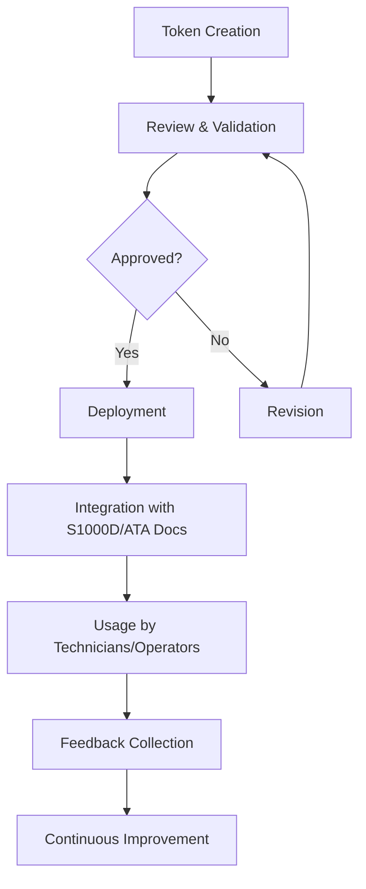

# MTL_Standard.md

**Methods Token Library (MTL) Standard Specification**

This document defines the core principles, formats, structures, and governance rules for creating, managing, and evolving the Methods Token Library (MTL). By adhering to these standards, all contributors can ensure that MTL tokens remain consistent, interoperable, and easy to integrate with existing aerospace and defense documentation frameworks, including S1000D and ATA references.

---

## 1. Purpose and Scope

The MTL standard ensures that every referenced method—be it a maintenance procedure, inspection guideline, calibration step, or advanced technique—is:

- **Consistently Named:** Follow a uniform naming convention that reflects domain, method ID, and version.
- **Version-Controlled:** Each token’s lifecycle is documented and traceable.
- **Interoperable:** Align with S1000D, ATA, and other aerospace standards for seamless integration.
- **Vendor & Domain-Neutral:** Applicable across OEMs, MROs, airlines, regulators, and various technology domains.
- **Future-Proof:** Capable of accommodating emerging methods (ALM, QCM, BIT, etc.) without structural overhauls.

---

## 2. MTL Token Format

Each MTL token follows the format:
```
MT-<DOMAIN>-<METHODID>-<VERSION>
```

- **MT:** Methods Token prefix.
- **<DOMAIN>:** Code representing the method’s domain (e.g., NDT, MFG, ELE, FUE, NAV, QCM).
- **<METHODID>:** Unique identifier for the method (e.g., CLEAN001, ULTRAS-INS).
- **<VERSION>:** Version control (V01, V02, ...).

**Example:** `MT-NDT-ULTRAS-INS-V01` for ultrasonic inspection (NDT domain), version 1.

---

## 3. Metadata and Content Structure

**Required Metadata:**
- **Title:** Descriptive name for the method.
- **Description:** Clear, STE-compliant explanation.
- **Applicability:** Aircraft types, components, or materials.
- **References:** Related standards, S1000D Data Modules, ATA chapters, MTL tokens, regulatory documents.
- **Safety Notes:** Warnings, hazards, PPE requirements.
- **Tools & Equipment:** Special tools or measuring devices.
- **Time/Manpower:** Estimated resources needed.
- **Version History & Approval Data:** Dates, approvers, rationale for version increments.

**Additional Fields:**
- **Regulatory Compliance:** E.g., FAA, EASA references.
- **Linked Tokens:** Reference to complementary MTL tokens.

Metadata should be stored in structured formats (XML/JSON) for easy integration with CMS, IoT, and AR platforms.

---

## 4. Versioning and Lifecycle Governance

- **Initial Creation:** Start at V01 with required approvals.
- **Updates:** Increment version for any significant change.
- **Deprecation:** Mark tokens as obsolete when replaced; provide substitutes.
- **Removal:** Only remove tokens after stakeholder consensus and when no active references remain.

Governance ensures tokens remain current, accurate, and aligned with evolving standards.

---

## 5. Integration and Interoperability

### S1000D/ATA Alignment

**Understanding DMC and SNS is crucial for integrating MTL with S1000D.**

#### Data Module Code (DMC)

A DMC uniquely identifies S1000D data modules, ensuring modularity and reusability. It contains segments for model identification, the Standard Numbering System (SNS), disassembly codes, information codes, and item location codes.

**Key Takeaways:**
- The DMC serves as a unique, structured identifier to locate and manage data modules.
- MTL tokens can reference these DMCs, linking standardized maintenance methods to specific aircraft systems.

**Example:**  
`GAA-7200-MP-00-E-0001` might be a DMC referencing engine maintenance procedures, where `7200` (SNS) links to ATA72 (Engines).

#### Standard Numbering System (SNS)

The SNS is part of the DMC and categorizes systems and subsystems (e.g., from ATA chapters). It helps maintain consistent references across documentation.

**SNS Segments:**
- **System:** 2 alphanumeric chars
- **Subsystem:** 1 alphanumeric char
- **Sub-subsystem:** 1 alphanumeric char
- **Unit/Assembly:** 2 or 4 alphanumeric chars

**Purpose:**
- Provides hierarchical breakdown of aircraft systems.
- Facilitates cross-referencing and modular integration of MTL tokens with S1000D modules.

### MTL and DMC/SNS Integration

- **Mapping MTL to DMC:** Each MTL token can reference one or more DMCs, ensuring that the method aligns with the correct SNS-defined system or assembly.
- **Single-Source Updates:** Modify an MTL token once and have changes propagate through all S1000D documents referencing that token.
- **Cross-Industry Compatibility:** Align MTL tokens with ATA chapters to maintain legacy familiarity while leveraging S1000D’s modular approach.

---

## 6. Approval Processes and Roles

- **Contributors:** Propose new or revised tokens.
- **Reviewers:** Validate compliance with standards, clarity, and technical accuracy.
- **Auditors:** Periodically review the library for outdated methods or regulatory changes.

Use GitHub Issues, forums, or working group sessions for feedback and collaborative improvements.

---

## 7. Governance and Community

- **Working Groups:** Host industry-wide workshops to discuss new standards, domains, and improvements.
- **Continuous Improvement:** Adapt MTL to evolving technologies (QCM, AR/VR) and emerging sustainability standards (SAF).

---

## 8. License

All specifications are under [CC BY-SA 4.0](https://creativecommons.org/licenses/by-sa/4.0/). Credit MTL for adaptations and share improvements openly.

---

## 9. Continuous Improvement

MTL evolves as industry changes. Contributors should:
- Identify metadata gaps.
- Suggest best practices for versioning and governance.
- Integrate new technologies (RPA, advanced analytics) as they mature.

---

## 10. Template Example

**JSON Representation:**

```json
{
  "id": "MT-NDT-ULTRAS-INS-V01",
  "domain": "NDT",
  "title": "Ultrasonic Inspection",
  "description": "Inspection of composite structures using ultrasonic methods.",
  "applicability": "Carbon fiber panels, metallic composites",
  "tools": ["Ultrasonic Probe", "Data Acquisition Unit"],
  "time_required": "2 hours",
  "version": "V01",
  "approvals": ["QA Lead: Approved", "Regulatory: FAA AD 2024-05-12 Compliant"],
  "linked_tokens": ["MT-MFG-PREP-V01"],
  "safety_notes": "Operators must wear hearing protection and ensure no FOD in vicinity.",
  "references": [
    "S1000D DM: NDT-2115-15-ICN",
    "ATA 51: Structures"
  ],
  "regulatory_compliance": "FAA AD 2024-05-12",
  "related_domains": ["MFG", "ELE"]
}
```

---

## 11. Interoperability Scenarios

### S1000D Mapping
`MT-NDT-ULTRAS-INS-V01` → integrated into `GAA-5100-MP-00-E-0001` (ATA51 for structures, MP for Maintenance Procedures).

### AR/VR Use Cases
Technicians can view MTL tokens in AR glasses, receiving step-by-step guidance aligned with S1000D procedures.

### QCM Integration
QCM algorithms can optimize when to apply a given MTL token based on resource availability and historical data trends.

---

## 12. Glossary of Acronyms and Terms

**ALM, API, AR, ATA, BIT, CAL, CMS, CSDB, CT, DMC, ELE, FUE, FI, HMI, ICN, IETP, IoT, IP, MFG, MRO, NAV, NDT, OEM, OP, QCM, RPA, SAF, SD, SNS, S1000D, STE, VR**

Refer to the appended glossary for detailed definitions.

---

## Strategic Observations and Recommendations

The MTL standard is robust, offering metadata structures, governance frameworks, and integration guides for S1000D, ATA chapters, IoT, AR/VR, and advanced technologies like QCM. Continuous improvement and stakeholder engagement are key to its long-term success.

---

## Appendices

### Additional Workflows and Diagrams

**Mermaid Example:**



### Security Considerations

- Implement role-based access control, encryption, digital signatures for token integrity.
- Use blockchain (BIT) for immutable audit logs and secure version histories.

### Multi-Language Support

- Provide translations as required, versioning them alongside English originals.
- Use translation management systems and STE compliance to maintain clarity.

### API Integration

- Define OpenAPI specs for token retrieval, updates, and searches.
- Integrate analytics to track token usage and improve MTL continuously.

---

# Conclusion and Next Steps

With DMC and SNS integration clearly outlined, MTL tokens can now seamlessly link to S1000D modules and ATA references. The MTL framework provides a future-proof foundation that supports evolving regulatory, technological, and operational needs.

**Next Steps:**
- Implement recommended diagrams and workflows.
- Develop domain-specific examples.
- Enhance security, feedback loops, analytics, and multi-language support.
- Continuously refine governance and improvement cycles.

By following these guidelines, the MTL standard will remain a cornerstone for efficient, interoperable, and scalable technical documentation in the aerospace and defense industries.

---
