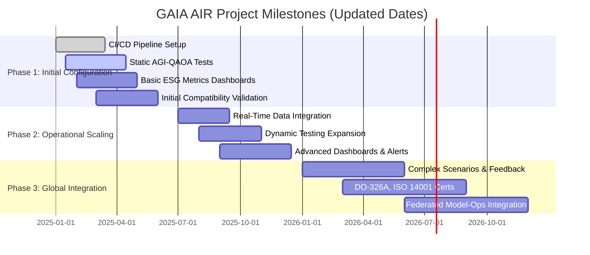
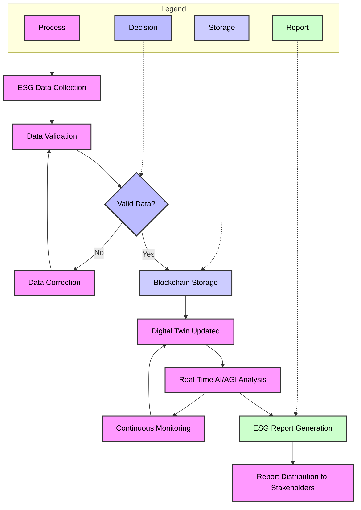

A continuación, presento una estructura detallada del **FTCode** (Functional Traceability Code) para GAIA AIR A360XWLRGA, desglosando sus módulos, campos, valores, descripciones, aplicaciones e impactos. Esta estructura facilitará la implementación, gestión y optimización de los procesos internos, asegurando una trazabilidad clara y uniforme.

---

## **Estructura Detallada del FTCode**

### **1. Módulos del FTCode**

El FTCode se divide en varios módulos, cada uno diseñado para gestionar diferentes aspectos de los procesos y componentes dentro del ecosistema GAIA AIR A360XWLRGA. A continuación, se detallan los módulos principales:

| **ID del Módulo** | **Nombre del Módulo**       | **Descripción**                                                                                  |
|-------------------|-----------------------------|--------------------------------------------------------------------------------------------------|
| M01               | Gestión de Componentes      | Administración y seguimiento de todos los componentes físicos y digitales utilizados en los sistemas. |
| M02               | Gestión de Procesos         | Estandarización y optimización de los procesos operativos y administrativos.                      |
| M03               | Gestión de Datos            | Recolección, almacenamiento y análisis de datos generados por los sistemas y procesos.            |
| M04               | Cumplimiento Normativo      | Aseguramiento del cumplimiento de normativas y estándares internacionales aplicables.             |
| M05               | Integración Tecnológica     | Facilitación de la interoperabilidad con tecnologías emergentes como IA, blockchain, etc.         |
| M06               | Mejora Continua             | Implementación de iniciativas para la optimización constante de procesos y tecnologías.           |
| M07               | Gestión de Seguridad        | Supervisión y mantenimiento de la seguridad de los sistemas y datos.                              |
| M08               | Sostenibilidad              | Monitoreo y gestión de indicadores de sostenibilidad y reducción de emisiones.                   |

### **2. Detalle de Campos por Módulo**

A continuación, se presentan los campos clave dentro de cada módulo, junto con sus posibles valores, descripciones, aplicaciones e impactos.

---

### **Módulo M01: Gestión de Componentes**

| **Campo ID** | **Nombre del Campo** | **Valores Permitidos**             | **Descripción**                                                                                                                                          | **Aplicaciones**                                           | **Impactos**                                                                                           |
|--------------|----------------------|------------------------------------|----------------------------------------------------------------------------------------------------------------------------------------------------------|------------------------------------------------------------|--------------------------------------------------------------------------------------------------------|
| M01-C01      | ID del Componente    | Alfanumérico único (ej. COMP-001)   | Identificador único para cada componente dentro del sistema.                                                                                            | Seguimiento y gestión de inventarios, mantenimiento.      | Facilita la trazabilidad y reduce errores en la identificación de componentes.                          |
| M01-C02      | Tipo de Componente   | Hardware, Software, Firmware, etc.  | Clasificación del componente según su naturaleza.                                                                                                       | Organización de inventarios, planificación de recursos.    | Mejora la organización y facilita la búsqueda y clasificación de componentes.                           |
| M01-C03      | Estado del Componente| Activo, En mantenimiento, Retirado | Estado actual del componente en su ciclo de vida.                                                                                                        | Gestión del ciclo de vida, planificación de reemplazos.     | Permite una gestión eficiente del ciclo de vida y evita interrupciones operativas.                      |
| M01-C04      | Fecha de Adquisición | Fecha (DD/MM/AAAA)                  | Fecha en que el componente fue adquirido o implementado en el sistema.                                                                                  | Historial de adquisiciones, análisis de gastos.             | Ayuda en la planificación de mantenimiento y reemplazos basados en la antigüedad de los componentes.      |
| M01-C05      | Proveedor            | Nombre del proveedor                | Nombre de la empresa o entidad que suministró el componente.                                                                                             | Gestión de relaciones con proveedores, evaluación de calidad.| Facilita la evaluación de proveedores y asegura la calidad de los componentes adquiridos.                |

---

### **Módulo M02: Gestión de Procesos**

| **Campo ID** | **Nombre del Campo** | **Valores Permitidos**                  | **Descripción**                                                                                                                                          | **Aplicaciones**                                       | **Impactos**                                                                                           |
|--------------|----------------------|-----------------------------------------|----------------------------------------------------------------------------------------------------------------------------------------------------------|--------------------------------------------------------|--------------------------------------------------------------------------------------------------------|
| M02-C01      | ID del Proceso       | Alfanumérico único (ej. PROC-001)        | Identificador único para cada proceso dentro del sistema.                                                                                                | Seguimiento y optimización de procesos.                | Facilita la identificación y mejora continua de procesos específicos.                                 |
| M02-C02      | Nombre del Proceso   | Texto descriptivo                       | Nombre descriptivo del proceso.                                                                                                                           | Documentación, formación de empleados.                | Mejora la claridad y comprensión de los procesos dentro de la organización.                            |
| M02-C03      | Responsable          | Nombre del empleado/Equipo responsable   | Persona o equipo encargado de la ejecución y supervisión del proceso.                                                                                     | Asignación de responsabilidades, rendición de cuentas. | Asegura que cada proceso tenga un responsable claro, mejorando la responsabilidad y eficiencia.        |
| M02-C04      | Frecuencia           | Diario, Semanal, Mensual, Anual, etc.    | Frecuencia con la que se ejecuta el proceso.                                                                                                             | Planificación y programación de actividades.           | Optimiza la planificación de recursos y asegura la regularidad en la ejecución de procesos críticos.   |
| M02-C05      | Indicadores de Rendimiento | KPIs específicos (ej. tiempo de ciclo) | Métricas utilizadas para evaluar el desempeño del proceso.                                                                                               | Monitoreo y evaluación del desempeño.                  | Facilita la identificación de áreas de mejora y el seguimiento del progreso hacia los objetivos.       |

---

### **Módulo M03: Gestión de Datos**

| **Campo ID** | **Nombre del Campo** | **Valores Permitidos**           | **Descripción**                                                                                                                                                | **Aplicaciones**                                       | **Impactos**                                                                                           |
|--------------|----------------------|----------------------------------|----------------------------------------------------------------------------------------------------------------------------------------------------------------|--------------------------------------------------------|--------------------------------------------------------------------------------------------------------|
| M03-C01      | ID del Dato          | Alfanumérico único (ej. DATA-001) | Identificador único para cada conjunto de datos.                                                                                                               | Seguimiento y gestión de datos.                        | Asegura una gestión eficiente y evita duplicidades o pérdidas de datos.                                |
| M03-C02      | Tipo de Dato         | Estructurado, No estructurado     | Clasificación del tipo de dato.                                                                                                                                | Organización y almacenamiento de datos.                | Facilita la gestión y el análisis de diferentes tipos de datos.                                        |
| M03-C03      | Fuente del Dato      | Sistema A, Sistema B, Manual      | Origen o fuente de donde proviene el dato.                                                                                                                     | Integración de sistemas, análisis de datos.            | Mejora la trazabilidad y confiabilidad de los datos utilizados en análisis y toma de decisiones.       |
| M03-C04      | Fecha de Creación    | Fecha (DD/MM/AAAA)                | Fecha en que se creó el dato.                                                                                                                                   | Historial de datos, auditorías.                         | Permite rastrear la evolución de los datos y su relevancia temporal.                                   |
| M03-C05      | Responsable de Datos | Nombre del empleado/Equipo        | Persona o equipo encargado de la gestión y mantenimiento de los datos.                                                                                         | Gestión de calidad de datos, asignación de responsabilidades. | Asegura la integridad y calidad de los datos gestionados.                                             |

---

### **Módulo M04: Cumplimiento Normativo**

| **Campo ID** | **Nombre del Campo** | **Valores Permitidos**            | **Descripción**                                                                                                                                          | **Aplicaciones**                                     | **Impactos**                                                                                           |
|--------------|----------------------|-----------------------------------|----------------------------------------------------------------------------------------------------------------------------------------------------------|------------------------------------------------------|--------------------------------------------------------------------------------------------------------|
| M04-C01      | ID de Normativa      | Alfanumérico único (ej. NORM-001)   | Identificador único para cada normativa o estándar aplicable.                                                                                            | Seguimiento de cumplimiento, auditorías.             | Facilita la gestión del cumplimiento y asegura la adherencia a normativas relevantes.                  |
| M04-C02      | Nombre de la Normativa | Texto descriptivo                  | Nombre completo de la normativa o estándar.                                                                                                               | Documentación, formación de empleados.               | Mejora la comprensión y visibilidad de las normativas que deben cumplirse.                            |
| M04-C03      | Requisito Específico | Texto detallado                    | Descripción detallada de los requisitos específicos de la normativa.                                                                                      | Implementación de requisitos, seguimiento.           | Asegura que los requisitos específicos sean claramente entendidos y aplicados correctamente.           |
| M04-C04      | Estado de Cumplimiento | Cumplido, Pendiente, En progreso | Estado actual del cumplimiento de la normativa.                                                                                                          | Monitoreo y reporte de cumplimiento.                 | Permite una visión clara del estado de cumplimiento y facilita la identificación de áreas que requieren atención. |
| M04-C05      | Fecha de Última Auditoría | Fecha (DD/MM/AAAA)               | Fecha en que se realizó la última auditoría de cumplimiento.                                                                                              | Planificación de auditorías, seguimiento histórico.  | Ayuda a programar futuras auditorías y asegurar el cumplimiento continuo de las normativas.           |

---

### **Módulo M05: Integración Tecnológica**

| **Campo ID** | **Nombre del Campo** | **Valores Permitidos**                  | **Descripción**                                                                                                                                          | **Aplicaciones**                                           | **Impactos**                                                                                           |
|--------------|----------------------|-----------------------------------------|----------------------------------------------------------------------------------------------------------------------------------------------------------|------------------------------------------------------------|--------------------------------------------------------------------------------------------------------|
| M05-C01      | ID de Tecnología     | Alfanumérico único (ej. TECH-001)        | Identificador único para cada tecnología integrada.                                                                                                       | Seguimiento y gestión de tecnologías emergentes.            | Facilita la adopción y monitoreo de nuevas tecnologías dentro del ecosistema.                         |
| M05-C02      | Nombre de la Tecnología | IA, Blockchain, Gemelos Digitales, etc. | Nombre descriptivo de la tecnología.                                                                                                                      | Documentación, formación, integración de sistemas.          | Mejora la visibilidad y comprensión de las tecnologías utilizadas, facilitando su gestión y uso.       |
| M05-C03      | Estado de Integración | Integrado, En proceso, Planificado      | Estado actual de la integración de la tecnología en los sistemas existentes.                                                                              | Planificación y seguimiento de proyectos de integración.    | Asegura una gestión eficiente de los proyectos tecnológicos y facilita la identificación de retrasos o problemas. |
| M05-C04      | Aplicación Específica | Mantenimiento Predictivo, Seguridad, etc. | Áreas o procesos específicos donde se aplica la tecnología.                                                                                                | Implementación en procesos específicos, mejora de funcionalidades. | Optimiza el uso de tecnologías en áreas clave, mejorando la eficiencia y efectividad de los procesos.    |
| M05-C05      | Impacto Esperado     | Reducción de Costos, Mejora de Eficiencia, etc. | Descripción de los beneficios o cambios esperados tras la integración de la tecnología.                                                                    | Evaluación de proyectos, seguimiento de beneficios.        | Permite medir y evaluar los beneficios reales de las tecnologías integradas, asegurando el retorno de inversión. |

---

### **Módulo M06: Mejora Continua**

| **Campo ID** | **Nombre del Campo** | **Valores Permitidos**           | **Descripción**                                                                                                                                          | **Aplicaciones**                                       | **Impactos**                                                                                           |
|--------------|----------------------|----------------------------------|----------------------------------------------------------------------------------------------------------------------------------------------------------|--------------------------------------------------------|--------------------------------------------------------------------------------------------------------|
| M06-C01      | ID de Iniciativa     | Alfanumérico único (ej. INIT-001)  | Identificador único para cada iniciativa de mejora continua.                                                                                             | Seguimiento y gestión de iniciativas de mejora.         | Facilita la priorización y seguimiento de las iniciativas para asegurar su implementación exitosa.    |
| M06-C02      | Nombre de la Iniciativa | Texto descriptivo                 | Nombre descriptivo de la iniciativa.                                                                                                                       | Documentación, comunicación interna.                    | Mejora la visibilidad y comprensión de las iniciativas dentro de la organización.                      |
| M06-C03      | Área de Aplicación   | Operativa, Tecnológica, Sostenibilidad, etc. | Área específica donde se implementará la iniciativa de mejora.                                                                                                | Implementación de mejoras en áreas clave.                | Permite una gestión focalizada y efectiva de las iniciativas, asegurando que aborden las áreas correctas. |
| M06-C04      | Estado de Implementación | Planificado, En progreso, Completado | Estado actual de la implementación de la iniciativa.                                                                                                       | Seguimiento y reporte de progreso.                       | Asegura una gestión efectiva del ciclo de vida de las iniciativas y facilita la identificación de retrasos. |
| M06-C05      | Impacto de la Iniciativa | Mejora de Procesos, Reducción de Costos, etc. | Descripción de los beneficios o cambios resultantes de la iniciativa.                                                                                        | Evaluación de beneficios, ajuste de estrategias.         | Permite medir y evaluar los beneficios reales de las iniciativas, asegurando que cumplan con los objetivos establecidos. |

---

### **Módulo M07: Gestión de Seguridad**

| **Campo ID** | **Nombre del Campo** | **Valores Permitidos**              | **Descripción**                                                                                                                                          | **Aplicaciones**                                           | **Impactos**                                                                                           |
|--------------|----------------------|-------------------------------------|----------------------------------------------------------------------------------------------------------------------------------------------------------|------------------------------------------------------------|--------------------------------------------------------------------------------------------------------|
| M07-C01      | ID de Riesgo         | Alfanumérico único (ej. RISK-001)     | Identificador único para cada riesgo de seguridad identificado.                                                                                          | Seguimiento y gestión de riesgos de seguridad.             | Facilita la identificación y mitigación proactiva de riesgos, mejorando la seguridad general.         |
| M07-C02      | Tipo de Riesgo       | Cibernético, Físico, Operacional, etc. | Clasificación del tipo de riesgo de seguridad.                                                                                                           | Análisis y priorización de riesgos.                        | Mejora la organización y priorización de los riesgos según su tipo y gravedad.                         |
| M07-C03      | Descripción del Riesgo | Texto detallado                      | Descripción detallada del riesgo identificado.                                                                                                            | Evaluación y planificación de mitigación.                   | Asegura una comprensión clara de cada riesgo, facilitando su gestión y mitigación efectiva.           |
| M07-C04      | Probabilidad         | Baja, Media, Alta                    | Probabilidad de que el riesgo ocurra.                                                                                                                     | Evaluación de riesgos, priorización.                        | Permite la priorización de riesgos basándose en su probabilidad, optimizando los recursos de mitigación. |
| M07-C05      | Impacto              | Bajo, Moderado, Alto                  | Impacto potencial si el riesgo se materializa.                                                                                                            | Evaluación de riesgos, planificación de respuesta.          | Ayuda a determinar la severidad de cada riesgo y a priorizar las acciones de mitigación.               |
| M07-C06      | Estrategia de Mitigación | Transferencia, Reducción, Aceptación, etc. | Estrategia seleccionada para mitigar el riesgo identificado.                                                                                              | Planificación de mitigación, implementación de estrategias. | Asegura que cada riesgo tenga una estrategia clara para su mitigación, reduciendo la vulnerabilidad.    |

---

### **Módulo M08: Sostenibilidad**

| **Campo ID** | **Nombre del Campo** | **Valores Permitidos**                  | **Descripción**                                                                                                                                          | **Aplicaciones**                                           | **Impactos**                                                                                           |
|--------------|----------------------|-----------------------------------------|----------------------------------------------------------------------------------------------------------------------------------------------------------|------------------------------------------------------------|--------------------------------------------------------------------------------------------------------|
| M08-C01      | ID de Indicador      | Alfanumérico único (ej. SUST-001)        | Identificador único para cada indicador de sostenibilidad.                                                                                               | Seguimiento y gestión de indicadores de sostenibilidad.    | Facilita el monitoreo y la gestión de los objetivos de sostenibilidad, asegurando el cumplimiento de metas ambientales. |
| M08-C02      | Nombre del Indicador | Texto descriptivo                        | Nombre descriptivo del indicador de sostenibilidad.                                                                                                      | Reportes de sostenibilidad, análisis de desempeño.        | Mejora la comprensión y seguimiento de los objetivos de sostenibilidad dentro de la organización.      |
| M08-C03      | Meta del Indicador   | Valor numérico o porcentaje               | Objetivo específico que se busca alcanzar para el indicador.                                                                                            | Planificación y evaluación de progreso.                    | Permite establecer objetivos claros y medir el progreso hacia la sostenibilidad.                       |
| M08-C04      | Valor Actual         | Valor numérico o porcentaje               | Valor actual del indicador en el momento del seguimiento.                                                                                                 | Comparación con la meta, evaluación de progreso.           | Facilita la identificación de brechas y la toma de decisiones para alcanzar las metas establecidas.      |
| M08-C05      | Periodicidad de Medición | Mensual, Trimestral, Anual             | Frecuencia con la que se mide el indicador.                                                                                                               | Planificación de reportes, seguimiento continuo.            | Asegura un monitoreo regular y oportuno de los indicadores de sostenibilidad.                           |
| M08-C06      | Responsable          | Nombre del empleado/Equipo               | Persona o equipo encargado de la gestión y reporte del indicador.                                                                                         | Asignación de responsabilidades, rendición de cuentas.      | Asegura que cada indicador tenga un responsable claro, mejorando la gestión y seguimiento de los objetivos. |

---

## **Aplicaciones del FTCode**

El **FTCode** se aplica de la siguiente manera dentro de GAIA AIR A360XWLRGA:

1. **Estandarización de Procesos y Componentes:**
   - Utilizando los módulos M01 y M02, se asegura que todos los procesos y componentes estén estandarizados, facilitando su gestión y optimización.

2. **Trazabilidad y Control:**
   - A través de los módulos M01, M03 y M07, el FTCode permite un seguimiento detallado de cada componente, dato y riesgo, asegurando un control total sobre el ciclo de vida de los elementos del sistema.

3. **Cumplimiento Normativo:**
   - El módulo M04 garantiza que todas las operaciones y componentes cumplan con las normativas internacionales, facilitando auditorías y asegurando la conformidad legal.

4. **Integración Tecnológica:**
   - Mediante el módulo M05, el FTCode facilita la adopción e integración de tecnologías emergentes, mejorando la interoperabilidad y eficiencia de los sistemas.

5. **Mejora Continua y Sostenibilidad:**
   - Los módulos M06 y M08 impulsan la mejora continua y el cumplimiento de objetivos de sostenibilidad, asegurando que la organización evolucione de manera eficiente y responsable.

## **Impactos del FTCode**

La implementación del FTCode tiene múltiples impactos positivos en GAIA AIR A360XWLRGA:

- **Mejora de la Eficiencia Operativa:** Optimiza los flujos de trabajo y reduce errores, aumentando la productividad general.
- **Reducción de Costos:** A través de la gestión eficiente de recursos y mantenimiento predictivo, se logran ahorros significativos.
- **Aseguramiento de la Calidad y Seguridad:** Garantiza que todos los componentes y procesos cumplan con los estándares de calidad y seguridad, minimizando riesgos operativos.
- **Facilitación de la Innovación:** La integración con tecnologías emergentes permite a la organización mantenerse a la vanguardia de la innovación en el sector aeroespacial.
- **Cumplimiento Normativo:** Alinea todas las operaciones con normativas internacionales, facilitando auditorías y evitando sanciones legales.
- **Sostenibilidad Ambiental:** Monitorea y gestiona indicadores de sostenibilidad, contribuyendo a la reducción de la huella de carbono y promoviendo prácticas ecológicas responsables.
- **Trazabilidad y Transparencia:** Proporciona una visibilidad completa de todos los elementos y procesos, facilitando la toma de decisiones informadas y la resolución de problemas de manera rápida y efectiva.

---

## **Conclusión**

El **FTCode** se presenta como una herramienta esencial para GAIA AIR A360XWLRGA, proporcionando una estructura estandarizada y trazable que optimiza la gestión de procesos, componentes y datos. Su implementación no solo mejora la eficiencia y reduce costos, sino que también asegura el cumplimiento normativo y promueve la sostenibilidad, posicionando a la organización como líder en innovación y responsabilidad ambiental en el sector aeroespacial.

**Recomendación:**  
Integrar el FTCode de manera progresiva, asegurando la capacitación adecuada de todos los empleados y monitoreando continuamente su efectividad a través de los indicadores establecidos. Esto garantizará una adopción exitosa y maximizará los beneficios derivados de su implementación.


---

**From these Freudian depths, GAIA DS emerges.**

This poetic expression suggests that GAIA DS, as a comprehensive and multifaceted framework, arises from profound conceptual foundations—akin to deep psychological layers or underlying motivators. Its origins and principles may be rooted in complex, introspective, and deeply analyzed considerations.

**Context for Sustainable Development:**

The need to develop a system determines its functional requirements and the necessary functionality. In industrial, distributed landscapes, it is urgent to prioritize development that is sustainable, fair, and auditable. This ensures that innovation and growth do not come at the expense of environmental health, ethical standards, or transparency.

---

**Requirement ID:** GAIA-DS-FR-01

**Requirement Class Card:**
This identifier (class card) can serve as a reference at various organizational levels:

- **Document ID:** Linking the requirement to a specific reference or specification document.
- **Project ID:** Associating the requirement with a particular GAIA DS project or initiative.
- **System ID:** Mapping the requirement to a system, subsystem, or portfolio within GAIA DS.
- **Org ID:** Connecting the requirement to an organizational or departmental unit accountable for its implementation.

**Top-Level Class Card (Portfolio):** Sustainable Development

**Functional Requirement (FR) 01:** Principal Framework (01)

---

**Description:**
The GAIA-DS-FR-01 requirement establishes the primary sustainable development framework at the portfolio level of the GAIA DS ecosystem. It defines the overarching principles, directives, and strategic objectives guiding all underlying projects and systems within the GAIA DS portfolio. Through this top-level requirement, GAIA DS ensures a unified approach to sustainability, encompassing environmental, social, economic, and technological dimensions.

---

**Key Objectives:**
1. **Alignment with Sustainability Targets:**  
   Align all GAIA DS initiatives with sustainability objectives (e.g., significant emission reductions, circular economy goals).

2. **Regulatory Compliance:**  
   Ensure adherence to global regulatory standards (EASA, FAA, ISO 14040, DO-326A) and industry best practices.

3. **Technological Integration:**  
   Incorporate advanced technologies (AI/AGI, QAOA, digital twins, blockchain) into sustainable, responsible operational models.

4. **Governance and Continuous Improvement:**  
   Maintain coherent governance structures (PROS, PRBS, SPLR-GAIA Quantum Portal, DOS, ReFrame) to support continuous improvement, innovation, and stakeholder engagement.

---

**Scope and Applicability:**
This requirement applies to the entire GAIA DS portfolio, including all subprograms (Aerospace, Computing & IT, Defense & Security, Space, Cross-Agency Sustainability) and their associated projects, systems, and organizational units. By encompassing the full range of GAIA DS activities, GAIA-DS-FR-01 ensures a consistently sustainable approach across diverse fields.

---

**Rationale:**
By defining a principal sustainable development framework as a functional requirement at the top-level portfolio stage, GAIA DS ensures consistent decision-making grounded in environmental and social responsibility. This approach fosters long-term resilience, competitiveness, and ethical innovation, aligning GAIA DS operations with global sustainability imperatives.

---

**Conclusion:**
GAIA-DS-FR-01 serves as the foundational functional requirement anchoring the GAIA DS portfolio’s commitment to sustainable development. It harmonizes various organizational, project, and system-level actions under a unified, sustainability-driven framework. In doing so, it guides the GAIA DS ecosystem to thrive responsibly, ethically, and transparently, meeting the urgent demands of industrial distributed landscapes and contributing to a cleaner, more efficient, and equitable future.

---

# GAIA DS: A Holistic and Sustainable Framework

**Definition:**  
GAIA DS (GAIA Sustainable Development) is a pioneering framework designed to address complex and interconnected challenges in sectors such as aerospace, sustainability, energy, defense, computing, and inter-agency collaboration. Envisioned by Amedeo Pelliccia, GAIA DS transcends traditional project boundaries, adopting a systems-of-systems approach that merges technological innovation, environmental stewardship, and social responsibility.

---

### Key Attributes of GAIA DS

**Multiscale:**  
GAIA DS operates across multiple scales—from nano-structured materials and advanced composites at the microscopic level to alignment with global regulatory and sustainability targets. It addresses community-level impacts, regional supply chain considerations, national regulatory standards, and international climate objectives simultaneously.

**Multidimensional:**  
GAIA DS spans various dimensions:
- **Technical:** Hybrid propulsion, DIFFUSP MHD engines, AI/AGI, QAOA, digital twins, IoT.
- **Environmental:** Circular economy, carbon reduction, waste minimization, high recyclability.
- **Economic:** Cost-effectiveness, long-term operational savings, stable supply chains, market competitiveness.
- **Social:** Ethical practices, community engagement, workforce development, transparency, academic and NGO collaboration.

**Multi-Objective:**  
GAIA DS targets multiple, often competing objectives:
- Carbon emission reductions (≥80% by 2050)
- Energy efficiency & reliability (improved MTBF)
- Circular economy (≥90% recyclability of critical materials)
- Regulatory compliance (EASA, FAA, ISO 14040, DO-326A)
- Innovation and social responsibility

**Multidomain:**  
GAIA DS extends across multiple domains and subprograms:
- **Aerospace (GAIA-AIR):** Hybrid propulsion, DIFFUSP MHD engines, advanced materials, sustainable aviation, ESG management.
- **Computing & IT (GAIA-COMPUTING-IT_PMOs):** HPC, cybersecurity, blockchain, CI/CD.
- **Defense & Security (GAIA-DEFENCE):** Secure communications, quantum-safe cryptography, resilient systems.
- **Space (GAIA-SPACE):** Methodologies extended to orbital platforms, satellites, interplanetary logistics.
- **Cross-Agency Sustainability (GAIA-SUSTAINABILITY-CROSS-AGENCY):** Harmonization of environmental policies and standards.

**Multi-Component & Multi-Stakeholder:**  
GAIA DS coordinates initiatives in propulsion (electric, hydrogen, solid-state batteries, DIFFUSP MHD), energy management (AI/AGI, QAOA, IoT sensors, digital twins), predictive maintenance, circular economy (DfD, blockchain), and security (AES-256, MFA, DO-326A).

**Multi-Program & Multi-Project:**  
GAIA DS integrates projects (GAIA AIR, GAIA SPACE, GAIA DEFENCE), R&D with universities, and IT/PMO functions to align with sustainable innovation goals.

**Master Triggers:** Regulatory shifts, technological breakthroughs (hydrogen, QAOA, composites), market & stakeholder feedback, environmental indicators, agile innovation cycles (CI/CD).

**Governance & Integration:**  
- PROS (Project Structure)
- PRBS (Product Breakdown Structure)
- SPLR-GAIA Quantum Portal (AI/AGI, QAOA, real-time monitoring, cybersecurity, quantum computing)
- DOS (Design Office Structure)
- ReFrame (Research Framework)

**Validation, Verification & Continuous Improvement:**  
Rigorous testing (bench, CFD/EM), external audits (EASA, FAA, ISO), continuous improvement loops, transparent documentation (S1000D), and robust training.

**Conclusion GAIA DS:**  
GAIA DS, as envisioned by Amedeo Pelliccia, sets the stage for a cleaner, more efficient, resilient, and globally connected aerospace industry by aligning environmental goals, technological advancement, circular economy principles, and regulatory compliance.

---

# POST

## GAIA AIR - Mermaid Diagrams

**Description:**  
This section includes Mermaid diagrams for GAIA AIR, supporting decision-making, ESG data management, and operational transparency.

### Gantt Diagram - GAIA AIR Project Milestones (Updated Dates)

**Description:**  
Shows project phases, milestones, progress, and dependencies.



### ESG Traceability Flowchart

**Description:**  
Illustrates ESG data handling in GAIA AIR: collection, validation, blockchain storage, digital twins, AI/AGI analysis, and ESG reporting.



**Notes:**
- Code block closure: triple backticks.
- Aspect ratio adjustable in the rendering platform.
- Font size increased to 16px for readability.
- Ensure Mermaid compatibility (Docsify, Asciidoctor, etc.).

---

## Expanding GAIA DS

- **Computing & IT (GAIA-COMPUTING-IT_PMOs):** HPC, cybersecurity, blockchain, CI/CD.
- **Defense & Security (GAIA-DEFENCE):** Secure communications, quantum-safe cryptography, resilient systems.
- **Space (GAIA-SPACE):** Orbital platforms, satellites, interplanetary logistics.
- **Cross-Agency Sustainability (GAIA-SUSTAINABILITY-CROSS-AGENCY):** Harmonizing environmental policies and standards.

Multi-Program & Multi-Project Integration: R&D with universities, market strategies (GAIA-INTERCONNECTED-PROGRAMS), and IT/PMO functions ensure alignment with sustainable and innovative objectives.

**Master Triggers & Governance:** Regulatory changes, tech advances, market feedback, environmental indicators, and agile innovation cycles guide actions. PROS, PRBS, SPLR-GAIA Quantum Portal, DOS, ReFrame ensure clarity, methodology, and adaptability.

---

## System Requirements Specification (SRS) - GAIA DS

**Context SRS:**  
A long-range, high-capacity hybrid aircraft with DIFFUSP MHD engines aligned with GAIA DS principles. The SRS includes objectives, scope, functional/non-functional requirements, regulatory compliance, circular economy, security, AI/AGI, QAOA, digital twins, blockchain, and cybersecurity.

**ATA JASC Index:**  
An adapted 8-digit ATA JASC index for GAIA AIR systems, subsystems, and components for efficient identification and management.

**Field Descriptions (ATA JASC):**  
System_Code, JASC_Code, Title, Description, Page_Number, CLASS_CATEGORY, DEEPLEVEL, DMC_DOMAIN_DESC, ASSIGNABLE_ATAXX_XX_XX_DESC, VERSION_MODEL, TYPE.

This SRS provides a foundation for validation, verification, risk management, updates, external audits (EASA, FAA, ISO), continuous improvement, and future scalability.

---

## Final Conclusion

GAIA DS, aligned with Amedeo Pelliccia’s vision, represents a complex, interconnected, and evolving ecosystem. Integrating sustainability, innovation, circular economy principles, AI/AGI, QAOA, cybersecurity, and international standards, GAIA DS redefines the aerospace industry toward a cleaner, more efficient, and resilient future.

This note sets a coherent foundation for ongoing expansions, validations, stakeholder engagement, and continuous technological evolution within the GAIA DS framework.

---

# Methods Token Library (MTL)

**A Unified Standard for Referencing and Managing Aerospace & Defense Methods**  
**A Transformative Framework for Automating Workflows and Standardizing Aerospace & Defense Methods**

Welcome to the Methods Token Library (MTL) repository. This project provides a scalable, standardized framework for referencing common procedures, tasks, and methods used throughout the aerospace and defense industries. By encapsulating methods—such as maintenance steps, inspection techniques, or calibration instructions—into discrete, version-controlled “tokens,” MTL establishes a single source of truth that streamlines technical documentation, operational workflows, and work order deliveries.

The result: **reduced redundancy, faster updates, improved efficiency, safety, cost-effectiveness, and a future-proof approach** to integrating emerging technologies and industry standards.

---

## What is MTL?

The MTL is a global reference system where industry-standard methods are stored as reusable tokens. Instead of rewriting identical instructions across multiple manuals or data modules, you reference an MTL token. Any updates to a token automatically reflect in all associated documents, ensuring continuous alignment with best practices, regulatory changes, and new technologies.

### Key Features

- **Standardized Methods:** Each method token follows a controlled naming and versioning scheme, reducing ambiguity and ensuring uniformity.
- **Single-Source Updates:** Revise a method once in the MTL, and all referencing documents and workflows update automatically—no manual intervention needed.
- **Interoperability:** The MTL integrates seamlessly with S1000D data modules, ATA chapters, and other aerospace standards.
- **Support for Advanced Technologies:** Integrate Additive Layer Manufacturing (ALM), Quantum Computing Modules (QCM), Blockchain-based security (BIT), and IoT-driven insights without overhauling documentation strategies.

---

## Repository Structure

- **`/docs`**:  
  - `MTL_Standard.md`: MTL format specification, code structures, lifecycle governance.  
  - `Methods_Glossary.md`: Controlled vocabulary and acronyms, following Simplified Technical English (STE).  
  - `Examples/`: Sample tokens, reference data modules, integration scenarios.

- **`/schema`**: Proposed XML/JSON schemas and APIs for integrating MTL tokens with authoring tools, CMS, or IoT platforms.

- **`/tools`**: Scripts, validators, utilities for token searching, version comparisons, and documentation stub generation.

---

## Naming Convention

Each token follows:
```
MT-<DOMAIN>-<METHODID>-<VERSION>
```
- `MT`: Methods Token prefix.
- `<DOMAIN>`: Domain code (e.g., NDT for Non-Destructive Testing).
- `<METHODID>`: Unique method ID (e.g., CLEAN001, ULTRAS-INS).
- `<VERSION>`: Version control (e.g., V01, V02).

**Example:** `MT-NDT-ULTRAS-INS-V01` for a standard ultrasonic inspection method (NDT domain), version 1.

---

## Integration with S1000D and ATA

- **S1000D:** In Maintenance Procedures (MP), Operation Procedures (OP), or System Descriptions (SD), reference tokens directly. For example:
  *“Perform ultrasonic inspection as per `MT-NDT-ULTRAS-INS-V01`.”*

- **ATA Chapters:** Align tokens with ATA chapters (e.g., ATA24 for electrical) to maintain familiarity and bridge traditional and modern frameworks.

---

## Dictionary and Simplified Technical English (STE)

The MTL dictionary ensures consistent terminology and adherence to STE, enabling global teams—human or AI-driven—to interpret instructions without ambiguity.

**See:** [`docs/Methods_Glossary.md`](./docs/Methods_Glossary.md)

---

## Contributing

We invite participation from aerospace OEMs, airlines, MROs, regulators, and experts:

- **Propose New Methods:** Submit new tokens with rationale, domain, usage context.
- **Improve Existing Methods:** Increment versions when standards evolve.
- **Expand the Dictionary:** Add STE-compliant terms to unify language across the industry.

Before contributing, review [`MTL_Standard.md`](./docs/MTL_Standard.md) and follow coding conventions and approval processes.

---

## License

This project is licensed under the [Creative Commons Attribution-ShareAlike 4.0 International (CC BY-SA 4.0)](https://creativecommons.org/licenses/by-sa/4.0/).

By using or contributing, you agree to:

- **Attribution:** Credit the MTL project and contributors.
- **ShareAlike:** Any derivatives must remain under CC BY-SA 4.0.

See [LICENSE](./LICENSE) for full details.

---

## Contact & Community

- **Issues & Requests:** Use GitHub Issues for bugs, feature requests, and improvements.  
- **Mailing List/Forum (Planned):** For in-depth governance and best practice discussions.  
- **Workshops & Working Groups:** For consortiums, regulatory bodies, or industry groups interested in adopting MTL, open an issue or contact maintainers.

---

## Future Roadmap

- **API Integration:** REST/GraphQL for real-time token retrieval.
- **Blockchain-Verified Updates (BIT):** Ensure tamper-proof versioning and compliance auditing.
- **IoT & AR/VR Tools:** Serve instructions directly to AR headsets or IoT-connected tools for real-time, on-site guidance.

---

## MTL’s Role in Automating Workflows and Work Order Deliveries

### 1. Automating Workflows

- **Standardized Referencing:** A single source of truth eliminates duplicated instructions.  
- **CMS & IoT Integration:** Authors embed token references once; IoT sensors trigger auto-generated work orders referencing the correct token.
- **Dynamic Maintenance & Repair:** Sensor-detected faults issue task orders aligned with the latest methods, ensuring technicians follow current best practices.

### 2. Automating Work Order Deliveries

- **Direct Token Integration:** Work orders cite tokens like `MT-NDT-ULTRAS-INS-V01`, guaranteeing accuracy and up-to-date instructions.
- **Blockchain Verification:** GAA-BIT integration provides tamper-proof records, ensuring compliance and verifiable audit trails.

### 3. Standardizing Design Processes

- **Consistent Documentation:** Aligning tokens with S1000D/ATA ensures a shared language across organizations.
- **Modular & Iterative Updates:** A token update cascades through all documentation and design references, simplifying compliance and adaptability.
- **Enhanced Collaboration:** OEMs, MROs, and regulators streamline communication and focus on innovation rather than resolving documentation conflicts.

### 4. Roadmap for Implementation

- **Phase 1:** Core MTL framework, naming conventions, S1000D/ATA integration.
- **Phase 2:** Develop APIs, automate workflow tasks, link IoT signals.
- **Phase 3:** Add blockchain-based version control and compliance checks.
- **Phase 4:** AR/VR interfaces, AI-driven predictive maintenance integration.
- **Phase 5:** Ongoing feedback loops and scalability to new methods/technologies.

### Economic Impact

- **Efficiency Gains:** Reduced redundancy and streamlined documentation lower administrative burdens and operational costs.
- **Safety & Compliance:** Uniform instructions and real-time updates improve adherence to regulations and reduce error risk.
- **Cost Savings & Innovation:** Freed from reconciling inconsistent documentation, teams can invest time in new tech development and performance optimization.

---

**In essence, MTL is not just a documentation tool—it’s a strategic enabler. By providing a unified, future-proof standard for referencing and maintaining aerospace and defense methods, MTL sets the stage for automated workflows, seamless work order deliveries, standardized design, and robust economic benefits.**
```
