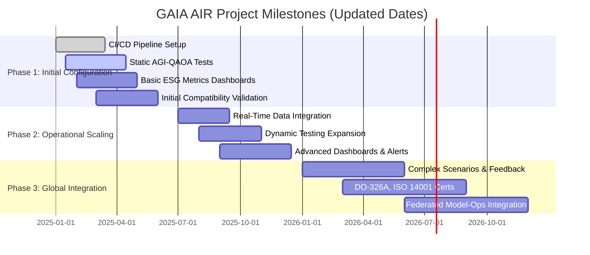
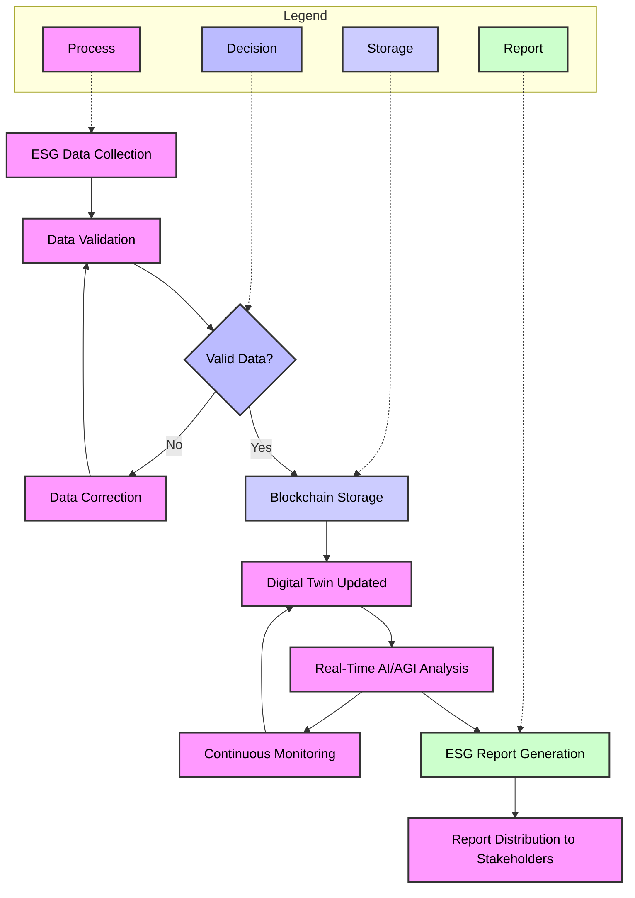

Below is a final, cleaned, and coherent version of the provided content. The text has been organized to maintain a logical flow from the GAIA DS introduction and requirements to the integration of MTL (Methods Token Library). All code blocks and references remain intact, and the text is fully in English, ensuring consistency and clarity.

---

**File:** `BreadcrumbsGAIA-DS-GAIA-AIR-WelcomeNote.md`


# PRE

**From these Freudian depths, GAIA DS emerges.**

This poetic expression suggests that GAIA DS, as a comprehensive and multifaceted framework, arises from profound conceptual foundations—akin to deep psychological layers or underlying motivators. Its origins and principles may be rooted in complex, introspective, and deeply analyzed considerations.

**Context for Sustainable Development:**

The need to develop a system determines its functional requirements and the necessary functionality. In industrial, distributed landscapes, it is urgent to prioritize development that is sustainable, fair, and auditable. This ensures that innovation and growth do not come at the expense of environmental health, ethical standards, or transparency.

---

**Requirement ID:** GAIA-DS-FR-01

**Requirement Class Card:**
This identifier (class card) can serve as a reference at various organizational levels:

- **Document ID:** Linking the requirement to a specific reference or specification document.
- **Project ID:** Associating the requirement with a particular GAIA DS project or initiative.
- **System ID:** Mapping the requirement to a system, subsystem, or portfolio within GAIA DS.
- **Org ID:** Connecting the requirement to an organizational or departmental unit accountable for its implementation.

**Top-Level Class Card (Portfolio):** Sustainable Development

**Functional Requirement (FR) 01:** Principal Framework (01)

---

**Description:**
The GAIA-DS-FR-01 requirement establishes the primary sustainable development framework at the portfolio level of the GAIA DS ecosystem. It defines the overarching principles, directives, and strategic objectives guiding all underlying projects and systems within the GAIA DS portfolio. Through this top-level requirement, GAIA DS ensures a unified approach to sustainability, encompassing environmental, social, economic, and technological dimensions.

---

**Key Objectives:**
1. **Alignment with Sustainability Targets:**  
   Align all GAIA DS initiatives with sustainability objectives (e.g., significant emission reductions, circular economy goals).

2. **Regulatory Compliance:**  
   Ensure adherence to global regulatory standards (EASA, FAA, ISO 14040, DO-326A) and industry best practices.

3. **Technological Integration:**  
   Incorporate advanced technologies (AI/AGI, QAOA, digital twins, blockchain) into sustainable, responsible operational models.

4. **Governance and Continuous Improvement:**  
   Maintain coherent governance structures (PROS, PRBS, SPLR-GAIA Quantum Portal, DOS, ReFrame) to support continuous improvement, innovation, and stakeholder engagement.

---

**Scope and Applicability:**
This requirement applies to the entire GAIA DS portfolio, including all subprograms (Aerospace, Computing & IT, Defense & Security, Space, Cross-Agency Sustainability) and their associated projects, systems, and organizational units. By encompassing the full range of GAIA DS activities, GAIA-DS-FR-01 ensures a consistently sustainable approach across diverse fields.

---

**Rationale:**
By defining a principal sustainable development framework as a functional requirement at the top-level portfolio stage, GAIA DS ensures consistent decision-making grounded in environmental and social responsibility. This approach fosters long-term resilience, competitiveness, and ethical innovation, aligning GAIA DS operations with global sustainability imperatives.

---

**Conclusion:**
GAIA-DS-FR-01 serves as the foundational functional requirement anchoring the GAIA DS portfolio’s commitment to sustainable development. It harmonizes various organizational, project, and system-level actions under a unified, sustainability-driven framework. In doing so, it guides the GAIA DS ecosystem to thrive responsibly, ethically, and transparently, meeting the urgent demands of industrial distributed landscapes and contributing to a cleaner, more efficient, and equitable future.

---

# GAIA DS: A Holistic and Sustainable Framework

**Definition:**  
GAIA DS (GAIA Sustainable Development) is a pioneering framework designed to address complex and interconnected challenges in sectors such as aerospace, sustainability, energy, defense, computing, and inter-agency collaboration. Envisioned by Amedeo Pelliccia, GAIA DS transcends traditional project boundaries, adopting a systems-of-systems approach that merges technological innovation, environmental stewardship, and social responsibility.

---

### Key Attributes of GAIA DS

**Multiscale:**  
GAIA DS operates across multiple scales—from nano-structured materials and advanced composites at the microscopic level to alignment with global regulatory and sustainability targets. It addresses community-level impacts, regional supply chain considerations, national regulatory standards, and international climate objectives simultaneously.

**Multidimensional:**  
GAIA DS spans various dimensions:
- **Technical:** Hybrid propulsion, DIFFUSP MHD engines, AI/AGI, QAOA, digital twins, IoT.
- **Environmental:** Circular economy, carbon reduction, waste minimization, high recyclability.
- **Economic:** Cost-effectiveness, long-term operational savings, stable supply chains, market competitiveness.
- **Social:** Ethical practices, community engagement, workforce development, transparency, academic and NGO collaboration.

**Multi-Objective:**  
GAIA DS targets multiple, often competing objectives:
- Carbon emission reductions (≥80% by 2050)
- Energy efficiency & reliability (improved MTBF)
- Circular economy (≥90% recyclability of critical materials)
- Regulatory compliance (EASA, FAA, ISO 14040, DO-326A)
- Innovation and social responsibility

**Multidomain:**  
GAIA DS extends across multiple domains and subprograms:
- **Aerospace (GAIA-AIR):** Hybrid propulsion, DIFFUSP MHD engines, advanced materials, sustainable aviation, ESG management.
- **Computing & IT (GAIA-COMPUTING-IT_PMOs):** HPC, cybersecurity, blockchain, CI/CD.
- **Defense & Security (GAIA-DEFENCE):** Secure communications, quantum-safe cryptography, resilient systems.
- **Space (GAIA-SPACE):** Methodologies extended to orbital platforms, satellites, interplanetary logistics.
- **Cross-Agency Sustainability (GAIA-SUSTAINABILITY-CROSS-AGENCY):** Harmonization of environmental policies and standards.

**Multi-Component & Multi-Stakeholder:**  
GAIA DS coordinates initiatives in propulsion (electric, hydrogen, solid-state batteries, DIFFUSP MHD), energy management (AI/AGI, QAOA, IoT sensors, digital twins), predictive maintenance, circular economy (DfD, blockchain), and security (AES-256, MFA, DO-326A).

**Multi-Program & Multi-Project:**  
GAIA DS integrates projects (GAIA AIR, GAIA SPACE, GAIA DEFENCE), R&D with universities, and IT/PMO functions to align with sustainable innovation goals.

**Master Triggers:** Regulatory shifts, technological breakthroughs (hydrogen, QAOA, composites), market & stakeholder feedback, environmental indicators, agile innovation cycles (CI/CD).

**Governance & Integration:**  
- PROS (Project Structure)
- PRBS (Product Breakdown Structure)
- SPLR-GAIA Quantum Portal (AI/AGI, QAOA, real-time monitoring, cybersecurity, quantum computing)
- DOS (Design Office Structure)
- ReFrame (Research Framework)

**Validation, Verification & Continuous Improvement:**  
Rigorous testing (bench, CFD/EM), external audits (EASA, FAA, ISO), continuous improvement loops, transparent documentation (S1000D), and robust training.

**Conclusion GAIA DS:**  
GAIA DS, as envisioned by Amedeo Pelliccia, sets the stage for a cleaner, more efficient, resilient, and globally connected aerospace industry by aligning environmental goals, technological advancement, circular economy principles, and regulatory compliance.

---

# POST

## GAIA AIR - Mermaid Diagrams

**Description:**  
This section includes Mermaid diagrams for GAIA AIR, supporting decision-making, ESG data management, and operational transparency.

### Gantt Diagram - GAIA AIR Project Milestones (Updated Dates)

**Description:**  
Shows project phases, milestones, progress, and dependencies.



### ESG Traceability Flowchart

**Description:**  
Illustrates ESG data handling in GAIA AIR: collection, validation, blockchain storage, digital twins, AI/AGI analysis, and ESG reporting.



**Notes:**
- Code block closure: triple backticks.
- Aspect ratio adjustable in the rendering platform.
- Font size increased to 16px for readability.
- Ensure Mermaid compatibility (Docsify, Asciidoctor, etc.).

---

## Expanding GAIA DS

- **Computing & IT (GAIA-COMPUTING-IT_PMOs):** HPC, cybersecurity, blockchain, CI/CD.
- **Defense & Security (GAIA-DEFENCE):** Secure communications, quantum-safe cryptography, resilient systems.
- **Space (GAIA-SPACE):** Orbital platforms, satellites, interplanetary logistics.
- **Cross-Agency Sustainability (GAIA-SUSTAINABILITY-CROSS-AGENCY):** Harmonizing environmental policies and standards.

Multi-Program & Multi-Project Integration: R&D with universities, market strategies (GAIA-INTERCONNECTED-PROGRAMS), and IT/PMO functions ensure alignment with sustainable and innovative objectives.

**Master Triggers & Governance:** Regulatory changes, tech advances, market feedback, environmental indicators, and agile innovation cycles guide actions. PROS, PRBS, SPLR-GAIA Quantum Portal, DOS, ReFrame ensure clarity, methodology, and adaptability.

---

## System Requirements Specification (SRS) - GAIA DS

**Context SRS:**  
A long-range, high-capacity hybrid aircraft with DIFFUSP MHD engines aligned with GAIA DS principles. The SRS includes objectives, scope, functional/non-functional requirements, regulatory compliance, circular economy, security, AI/AGI, QAOA, digital twins, blockchain, and cybersecurity.

**ATA JASC Index:**  
An adapted 8-digit ATA JASC index for GAIA AIR systems, subsystems, and components for efficient identification and management.

**Field Descriptions (ATA JASC):**  
System_Code, JASC_Code, Title, Description, Page_Number, CLASS_CATEGORY, DEEPLEVEL, DMC_DOMAIN_DESC, ASSIGNABLE_ATAXX_XX_XX_DESC, VERSION_MODEL, TYPE.

This SRS provides a foundation for validation, verification, risk management, updates, external audits (EASA, FAA, ISO), continuous improvement, and future scalability.

---

## Final Conclusion

GAIA DS, aligned with Amedeo Pelliccia’s vision, represents a complex, interconnected, and evolving ecosystem. Integrating sustainability, innovation, circular economy principles, AI/AGI, QAOA, cybersecurity, and international standards, GAIA DS redefines the aerospace industry toward a cleaner, more efficient, and resilient future.

This note sets a coherent foundation for ongoing expansions, validations, stakeholder engagement, and continuous technological evolution within the GAIA DS framework.

---

# Methods Token Library (MTL)

**A Unified Standard for Referencing and Managing Aerospace & Defense Methods**  
**A Transformative Framework for Automating Workflows and Standardizing Aerospace & Defense Methods**

Welcome to the Methods Token Library (MTL) repository. This project provides a scalable, standardized framework for referencing common procedures, tasks, and methods used throughout the aerospace and defense industries. By encapsulating methods—such as maintenance steps, inspection techniques, or calibration instructions—into discrete, version-controlled “tokens,” MTL establishes a single source of truth that streamlines technical documentation, operational workflows, and work order deliveries.

The result: **reduced redundancy, faster updates, improved efficiency, safety, cost-effectiveness, and a future-proof approach** to integrating emerging technologies and industry standards.

---

## What is MTL?

The MTL is a global reference system where industry-standard methods are stored as reusable tokens. Instead of rewriting identical instructions across multiple manuals or data modules, you reference an MTL token. Any updates to a token automatically reflect in all associated documents, ensuring continuous alignment with best practices, regulatory changes, and new technologies.

### Key Features

- **Standardized Methods:** Each method token follows a controlled naming and versioning scheme, reducing ambiguity and ensuring uniformity.
- **Single-Source Updates:** Revise a method once in the MTL, and all referencing documents and workflows update automatically—no manual intervention needed.
- **Interoperability:** The MTL integrates seamlessly with S1000D data modules, ATA chapters, and other aerospace standards.
- **Support for Advanced Technologies:** Integrate Additive Layer Manufacturing (ALM), Quantum Computing Modules (QCM), Blockchain-based security (BIT), and IoT-driven insights without overhauling documentation strategies.

---

## Repository Structure

- **`/docs`**:  
  - `MTL_Standard.md`: MTL format specification, code structures, lifecycle governance.  
  - `Methods_Glossary.md`: Controlled vocabulary and acronyms, following Simplified Technical English (STE).  
  - `Examples/`: Sample tokens, reference data modules, integration scenarios.

- **`/schema`**: Proposed XML/JSON schemas and APIs for integrating MTL tokens with authoring tools, CMS, or IoT platforms.

- **`/tools`**: Scripts, validators, utilities for token searching, version comparisons, and documentation stub generation.

---

## Naming Convention

Each token follows:
```
MT-<DOMAIN>-<METHODID>-<VERSION>
```
- `MT`: Methods Token prefix.
- `<DOMAIN>`: Domain code (e.g., NDT for Non-Destructive Testing).
- `<METHODID>`: Unique method ID (e.g., CLEAN001, ULTRAS-INS).
- `<VERSION>`: Version control (e.g., V01, V02).

**Example:** `MT-NDT-ULTRAS-INS-V01` for a standard ultrasonic inspection method (NDT domain), version 1.

---

## Integration with S1000D and ATA

- **S1000D:** In Maintenance Procedures (MP), Operation Procedures (OP), or System Descriptions (SD), reference tokens directly. For example:
  *“Perform ultrasonic inspection as per `MT-NDT-ULTRAS-INS-V01`.”*

- **ATA Chapters:** Align tokens with ATA chapters (e.g., ATA24 for electrical) to maintain familiarity and bridge traditional and modern frameworks.

---

## Dictionary and Simplified Technical English (STE)

The MTL dictionary ensures consistent terminology and adherence to STE, enabling global teams—human or AI-driven—to interpret instructions without ambiguity.

**See:** [`docs/Methods_Glossary.md`](./docs/Methods_Glossary.md)

---

## Contributing

We invite participation from aerospace OEMs, airlines, MROs, regulators, and experts:

- **Propose New Methods:** Submit new tokens with rationale, domain, usage context.
- **Improve Existing Methods:** Increment versions when standards evolve.
- **Expand the Dictionary:** Add STE-compliant terms to unify language across the industry.

Before contributing, review [`MTL_Standard.md`](./docs/MTL_Standard.md) and follow coding conventions and approval processes.

---

## License

This project is licensed under the [Creative Commons Attribution-ShareAlike 4.0 International (CC BY-SA 4.0)](https://creativecommons.org/licenses/by-sa/4.0/).

By using or contributing, you agree to:

- **Attribution:** Credit the MTL project and contributors.
- **ShareAlike:** Any derivatives must remain under CC BY-SA 4.0.

See [LICENSE](./LICENSE) for full details.

---

## Contact & Community

- **Issues & Requests:** Use GitHub Issues for bugs, feature requests, and improvements.  
- **Mailing List/Forum (Planned):** For in-depth governance and best practice discussions.  
- **Workshops & Working Groups:** For consortiums, regulatory bodies, or industry groups interested in adopting MTL, open an issue or contact maintainers.

---

## Future Roadmap

- **API Integration:** REST/GraphQL for real-time token retrieval.
- **Blockchain-Verified Updates (BIT):** Ensure tamper-proof versioning and compliance auditing.
- **IoT & AR/VR Tools:** Serve instructions directly to AR headsets or IoT-connected tools for real-time, on-site guidance.

---

## MTL’s Role in Automating Workflows and Work Order Deliveries

### 1. Automating Workflows

- **Standardized Referencing:** A single source of truth eliminates duplicated instructions.  
- **CMS & IoT Integration:** Authors embed token references once; IoT sensors trigger auto-generated work orders referencing the correct token.
- **Dynamic Maintenance & Repair:** Sensor-detected faults issue task orders aligned with the latest methods, ensuring technicians follow current best practices.

### 2. Automating Work Order Deliveries

- **Direct Token Integration:** Work orders cite tokens like `MT-NDT-ULTRAS-INS-V01`, guaranteeing accuracy and up-to-date instructions.
- **Blockchain Verification:** GAA-BIT integration provides tamper-proof records, ensuring compliance and verifiable audit trails.

### 3. Standardizing Design Processes

- **Consistent Documentation:** Aligning tokens with S1000D/ATA ensures a shared language across organizations.
- **Modular & Iterative Updates:** A token update cascades through all documentation and design references, simplifying compliance and adaptability.
- **Enhanced Collaboration:** OEMs, MROs, and regulators streamline communication and focus on innovation rather than resolving documentation conflicts.

### 4. Roadmap for Implementation

- **Phase 1:** Core MTL framework, naming conventions, S1000D/ATA integration.
- **Phase 2:** Develop APIs, automate workflow tasks, link IoT signals.
- **Phase 3:** Add blockchain-based version control and compliance checks.
- **Phase 4:** AR/VR interfaces, AI-driven predictive maintenance integration.
- **Phase 5:** Ongoing feedback loops and scalability to new methods/technologies.

### Economic Impact

- **Efficiency Gains:** Reduced redundancy and streamlined documentation lower administrative burdens and operational costs.
- **Safety & Compliance:** Uniform instructions and real-time updates improve adherence to regulations and reduce error risk.
- **Cost Savings & Innovation:** Freed from reconciling inconsistent documentation, teams can invest time in new tech development and performance optimization.

---

**In essence, MTL is not just a documentation tool—it’s a strategic enabler. By providing a unified, future-proof standard for referencing and maintaining aerospace and defense methods, MTL sets the stage for automated workflows, seamless work order deliveries, standardized design, and robust economic benefits.**
```
