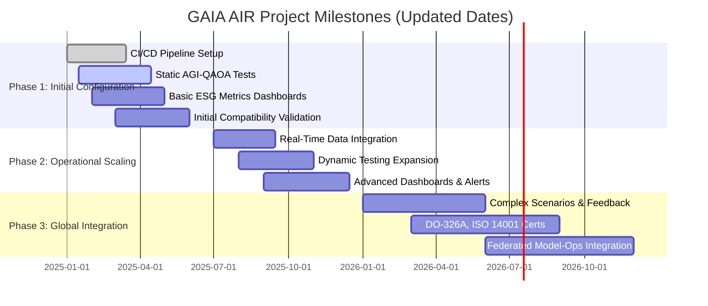
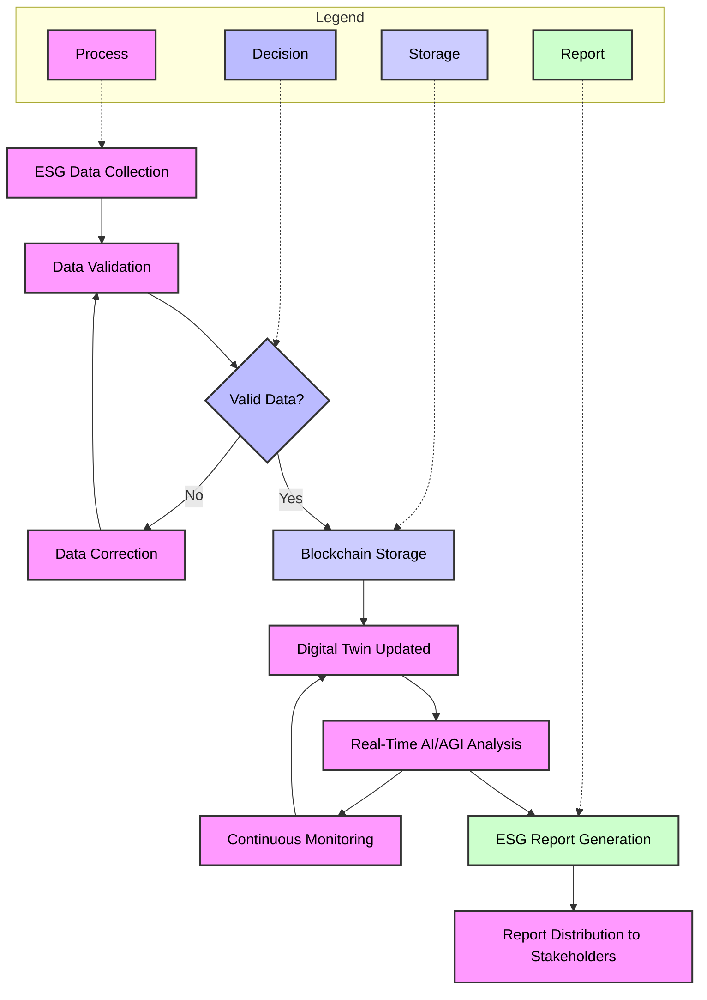

## **FTCode (Functional Traceability Code) – Versión Integrada y Mejorada en Orden de Ciclo**

El FTCode se concibe como un estándar funcional que proporciona trazabilidad, eficiencia, cumplimiento normativo, innovación tecnológica y sostenibilidad en todas las operaciones y sistemas de GAIA AIR A360XWLRGA. Esta herramienta es clave para optimizar procesos, gestionar componentes, asegurar la conformidad legal y medioambiental, integrar tecnologías emergentes y promover la mejora continua, posicionando a la organización a la vanguardia del sector aeroespacial y alineada con una visión de cero emisiones en sus procesos.

---

## **Resumen Ejecutivo**

**Objetivo del FTCode:**  
Establecer una estructura sistemática y modular que permita una trazabilidad completa, organización y optimización de todos los aspectos operativos, técnicos, normativos y sostenibles dentro de GAIA AIR A360XWLRGA. El FTCode se convierte así en la columna vertebral que integra procesos, componentes, datos, normativas y tecnologías emergentes (IA/AGI, computación cuántica, blockchain, gemelos digitales), garantizando no solo la mejora continua en eficiencia y reducción de costos, sino también la anulación completa de emisiones contaminantes, apoyando así una operación 100% limpia y sostenible.

**Beneficios a Largo Plazo:**  
- **Eficiencia Operativa Continua:** Mejora de la productividad, disminución de errores, tiempos de operación optimizados.
- **Costos Reducidos:** A través de mantenimiento predictivo, manejo eficiente de recursos y planificación proactiva.
- **Cero Emisiones:** Se supera el enfoque de reducción y se adopta una meta de anulación de emisiones, alineada con una estrategia de aviación completamente limpia y sin impacto ambiental.
- **Liderazgo en Innovación:** La adopción de IA/AGI, computación cuántica y gemelos digitales asegura una ventaja competitiva y un posicionamiento tecnológico de vanguardia.
- **Cumplimiento Normativo y Sostenibilidad:** Asegura el cumplimiento estricto de normativas internacionales (ISO, S1000D, ATA100), con metas de emisiones nulas y mejores prácticas ambientales (ISO14001, ESG).

---

## **Módulos del FTCode en Orden de Ciclo**

El FTCode se organiza en módulos que reflejan el ciclo de vida de los procesos y productos dentro de la organización:

| ID  | Módulo                    | Descripción                                                                                   |
|-----|---------------------------|-----------------------------------------------------------------------------------------------|
| M01 | Diseño                    | Desarrollo y gestión de diseños de productos y sistemas, asegurando calidad y conformidad.    |
| M02 | Modelado                  | Creación y mantenimiento de modelos digitales y simulaciones para optimización y análisis.     |
| M03 | Gestión de Procesos       | Estandarización y optimización de procesos operativos y administrativos.                      |
| M04 | Gestión de Componentes    | Administración, seguimiento y ciclo de vida de componentes físicos y digitales.               |
| M05 | Gestión de Datos          | Recolección, almacenamiento, análisis y trazabilidad de datos.                                |
| M06 | Integración Tecnológica   | Interoperabilidad con IA/AGI, blockchain, computación cuántica, gemelos digitales, etc.       |
| M07 | Cumplimiento Normativo    | Aseguramiento de conformidad con normativas internacionales (ISO, S1000D, ATA100, DO).        |
| M08 | Gestión de Seguridad      | Supervisión y mantenimiento de la seguridad de sistemas y datos, gestión de riesgos.          |
| M09 | Sostenibilidad            | Monitoreo de indicadores sostenibles, metas de cero emisiones, gestión ambiental integral.    |
| M10 | Mejora Continua           | Iniciativas para la optimización constante de procesos, eficiencia y tecnologías.            |

---

## **Detalle de Campos por Módulo**

A continuación se describen los campos clave en cada módulo, junto con valores, descripciones, aplicaciones, impactos y KPIs específicos.

### **Módulo M01: Diseño**

Este módulo abarca todas las actividades relacionadas con el diseño de productos, sistemas y componentes, asegurando que se cumplan los estándares de calidad y las normativas aplicables.

| Campo ID  | Nombre del Campo    | Valores             | Descripción                                              | Aplicaciones                       | Impactos                                     | KPIs Específicos                                   |
|-----------|---------------------|---------------------|----------------------------------------------------------|------------------------------------|----------------------------------------------|---------------------------------------------------|
| M01-C01   | ID de Diseño        | Alfanumérico único  | Identifica cada diseño individualmente.                 | Gestión de proyectos de diseño      | Garantiza trazabilidad y evita confusiones.  | - Tiempo de aprobación de diseños<br>- Tasa de reutilización de diseños |
| M01-C02   | Tipo de Diseño      | Producto, Sistema, Componente | Clasifica el diseño según su naturaleza.          | Organización de proyectos           | Mejora organización y búsquedas.             | - Distribución de diseños por tipo                |
| M01-C03   | Estado del Diseño   | En Desarrollo, Aprobado, Obsoleto | Indica el estado actual del diseño.            | Seguimiento de proyectos            | Facilita la gestión de versiones y actualizaciones. | - Porcentaje de diseños aprobados<br>- Tiempo en cada estado |
| M01-C04   | Fecha de Creación   | Fecha (DD/MM/AAAA) | Registra cuándo se inició el diseño.                    | Historial de proyectos              | Permite seguimiento temporal y planificación. | - Tiempo desde inicio hasta aprobación<br>- Promedio de tiempo de diseño |
| M01-C05   | Responsable de Diseño | Nombre/Equipo      | Quién está a cargo del diseño.                           | Asignación de responsabilidades     | Asegura responsabilidad y eficiencia.       | - Cumplimiento de plazos de diseño<br>- Calidad de los diseños (evaluada por revisiones) |

**Comentarios Específicos por Módulo:**

- **Campo M01-C03 (Estado del Diseño):**  
  Definir claramente las etapas del diseño para facilitar la gestión y seguimiento.
  
  **Ejemplo de Estados:**
  - **En Desarrollo:** Diseño en proceso de creación.
  - **Aprobado:** Diseño finalizado y aprobado para implementación.
  - **Obsoleto:** Diseño ya no utilizado o reemplazado por uno nuevo.

### **Módulo M02: Modelado**

Este módulo se centra en la creación y gestión de modelos digitales y simulaciones que permiten optimizar y analizar productos y sistemas antes de su implementación física.

| Campo ID  | Nombre del Campo    | Valores             | Descripción                                              | Aplicaciones                       | Impactos                                     | KPIs Específicos                                   |
|-----------|---------------------|---------------------|----------------------------------------------------------|------------------------------------|----------------------------------------------|---------------------------------------------------|
| M02-C01   | ID de Modelo        | Alfanumérico único  | Identifica cada modelo individualmente.                  | Gestión de proyectos de modelado    | Garantiza trazabilidad y evita confusiones.  | - Tiempo de creación de modelos<br>- Tasa de reutilización de modelos |
| M02-C02   | Tipo de Modelo      | CAD, BIM, Simulación, Otros | Clasifica el modelo según su naturaleza.        | Organización de proyectos           | Mejora organización y búsquedas.             | - Distribución de modelos por tipo                |
| M02-C03   | Estado del Modelo   | En Desarrollo, Validado, Obsoleto | Indica el estado actual del modelo.        | Seguimiento de proyectos            | Facilita la gestión de versiones y actualizaciones. | - Porcentaje de modelos validados<br>- Tiempo en cada estado |
| M02-C04   | Fecha de Creación   | Fecha (DD/MM/AAAA) | Registra cuándo se inició el modelado.                    | Historial de proyectos              | Permite seguimiento temporal y planificación. | - Tiempo desde inicio hasta validación<br>- Promedio de tiempo de modelado |
| M02-C05   | Responsable de Modelado | Nombre/Equipo      | Quién está a cargo del modelado.                           | Asignación de responsabilidades     | Asegura responsabilidad y eficiencia.       | - Cumplimiento de plazos de modelado<br>- Calidad de los modelos (evaluada por revisiones) |
| M02-C06   | Herramienta Utilizada | Autodesk, SolidWorks, Ansys, Otros | Indica la herramienta utilizada para el modelado. | Gestión de recursos y licencias     | Facilita la selección y capacitación en herramientas. | - Uso de herramientas por proyecto<br>- Eficiencia en el uso de herramientas |

**Comentarios Específicos por Módulo:**

- **Campo M02-C06 (Herramienta Utilizada):**  
  Incluir una lista de herramientas estándar para asegurar consistencia y facilitar la formación del personal.
  
  **Ejemplo de Herramientas:**
  - **Autodesk:** Para diseño CAD.
  - **SolidWorks:** Para diseño mecánico.
  - **Ansys:** Para simulaciones de ingeniería.
  - **Blender:** Para modelado 3D avanzado.

### **Módulo M03: Gestión de Procesos**

| Campo ID  | Nombre del Campo   | Valores              | Descripción                                          | Aplicaciones                 | Impactos                                             | KPIs Específicos                                   |
|-----------|--------------------|----------------------|------------------------------------------------------|------------------------------|-------------------------------------------------------|---------------------------------------------------|
| M03-C01   | ID del Proceso     | Alfanumérico único   | Identifica cada proceso.                            | Seguimiento y optimización   | Mejora continua, eficiencia en operación.             | - Tasa de cumplimiento de procesos<br>- Tiempo promedio de ciclo<br>- Porcentaje de reducción de errores |
| M03-C02   | Nombre del Proceso | Texto descriptivo    | Nombra el proceso claramente.                       | Documentación, formación     | Facilita comprensión interna.                         | - Número de procesos estandarizados               |
| M03-C03   | Responsable        | Nombre/Equipo        | Asigna un responsable del proceso.                  | Rendición de cuentas         | Asegura responsabilidad y eficiencia.                 | - Cumplimiento de responsabilidades asignadas     |
| M03-C04   | Frecuencia         | Diario, Semanal...   | Indica periodicidad del proceso.                    | Programación de actividades  | Uso óptimo de recursos y regularidad.                 | - Adherencia a la frecuencia establecida           |
| M03-C05   | Indicadores        | KPIs específicos     | Métricas para evaluar desempeño del proceso.        | Monitoreo de rendimiento     | Identifica áreas de mejora y logros.                  | - Tasa de cumplimiento de procesos<br>- Tiempo promedio de ciclo<br>- Porcentaje de reducción de errores |

### **Módulo M04: Gestión de Componentes**

| Campo ID  | Nombre del Campo    | Valores             | Descripción                                              | Aplicaciones                       | Impactos                                     | KPIs Específicos                                   |
|-----------|---------------------|---------------------|----------------------------------------------------------|------------------------------------|----------------------------------------------|---------------------------------------------------|
| M04-C01   | ID del Componente   | Alfanumérico único  | Identifica cada componente individualmente.             | Inventarios, mantenimiento          | Garantiza trazabilidad y evita confusiones.  | - Tiempo de localización de componentes<br>- Tasa de precisión de inventarios |
| M04-C02   | Tipo de Componente  | Hardware, Software  | Clasifica el componente según su naturaleza.            | Organización de inventarios         | Mejora organización y búsquedas.             | - Distribución de componentes por tipo            |
| M04-C03   | Estado del Componente| Activo, Mantenimiento, Retirado | Indica estado actual en el ciclo de vida.   | Planificación de reemplazos         | Evita interrupciones operativas.             | - Tiempo en cada estado<br>- Porcentaje de componentes activos vs. retirados |
| M04-C04   | Fecha de Adquisición | Fecha (DD/MM/AAAA) | Registra cuándo se adquirió el componente.              | Historial de adquisiciones          | Planifica mantenimiento y actualizaciones.   | - Promedio de tiempo entre adquisiciones<br>- Tiempo desde adquisición hasta activación |
| M04-C05   | Proveedor           | Nombre del proveedor| Indica la empresa que suministró el componente.          | Evaluación de proveedores           | Asegura calidad y confiabilidad del supply.  | - Tasa de cumplimiento de proveedores<br>- Tiempo promedio de entrega |

### **Módulo M05: Gestión de Datos**

| Campo ID  | Nombre del Campo   | Valores             | Descripción                                       | Aplicaciones                    | Impactos                                       | KPIs Específicos                                   |
|-----------|--------------------|---------------------|---------------------------------------------------|---------------------------------|------------------------------------------------|---------------------------------------------------|
| M05-C01   | ID del Dato        | Alfanumérico único  | Identifica conjuntos de datos.                    | Seguimiento de datos, auditorías | Evita duplicidades y pérdidas de datos.         | - Tasa de duplicidad de datos<br>- Integridad de datos |
| M05-C02   | Tipo de Dato       | Estructurado/No Estruct. | Clasifica el tipo de dato.                 | Organización, análisis           | Facilita el análisis y gestión de datos.       | - Distribución de datos estructurados vs. no estructurados |
| M05-C03   | Fuente del Dato    | Sistema A, Manual   | Origen de los datos.                             | Integración y confiabilidad     | Mejora trazabilidad y calidad de datos.         | - Calidad de las fuentes de datos<br>- Tiempo de integración de datos |
| M05-C04   | Fecha de Creación  | Fecha               | Indica cuándo se generó el dato.                 | Historial y contexto de datos   | Rastrea evolución y relevancia temporal.        | - Retención de datos<br>- Actualización de datos     |
| M05-C05   | Responsable de Datos| Nombre/Equipo       | Quién gestiona la calidad del dato.              | Asignación de responsabilidades | Asegura integridad y calidad de datos.          | - Tasa de errores en los datos<br>- Cumplimiento de estándares de calidad |

### **Módulo M06: Integración Tecnológica**

| Campo ID  | Nombre del Campo      | Valores                   | Descripción                                                          | Aplicaciones                 | Impactos                                         | KPIs Específicos                                   |
|-----------|-----------------------|---------------------------|----------------------------------------------------------------------|------------------------------|--------------------------------------------------|---------------------------------------------------|
| M06-C01   | ID de Tecnología      | Alfanumérico único        | Identifica cada tecnología.                                          | Gestión de TI y Proyectos    | Control de adopción tecnológica.                 | - Número de tecnologías integradas<br>- Tiempo de integración tecnológica |
| M06-C02   | Nombre de la Tecnología | IA, Blockchain, etc.     | Nombra la tecnología.                                                | Documentación, capacitación  | Facilita adopción y comprensión internas.        | - Nivel de adopción tecnológica<br>- Tasa de utilización de tecnologías |
| M06-C03   | Estado de Integración | Integrado, En proceso...  | Describe el grado de integración.                                    | Monitoreo de proyectos TI    | Detecta retrasos y optimiza recursos.             | - Porcentaje de integración completada<br>- Tiempo de implementación |
| M06-C04   | Aplicación Específica | Mantenimiento Predictivo, Seguridad | Indica dónde se aplica la tecnología.                 | Implementación dirigida       | Asegura uso óptimo de tecnología en áreas clave.  | - Número de aplicaciones específicas<br>- Impacto de las aplicaciones en operaciones |
| M06-C05   | Impacto Esperado      | Cero Emisiones, Eficiencia, etc. | Resultados esperados tras la adopción.                        | Evaluación de ROI y beneficios| Mide el éxito de las implementaciones tecnológicas.| - Nivel de impacto alcanzado (bajo, medio, alto)<br>- Retorno de inversión tecnológica |

**Comentarios Específicos por Módulo:**

- **Valor de "Impacto Esperado":**  
  Ampliar la lista de posibles impactos y proporcionar una escala para medir el grado de impacto.
  
  **Ejemplo:**
  - Cero Emisiones (Alto)
  - Eficiencia Operativa (Medio)
  - Reducción de Costos (Medio)
  - Mejora de la Seguridad (Alto)

### **Módulo M07: Cumplimiento Normativo**

| Campo ID  | Nombre del Campo      | Valores              | Descripción                                                 | Aplicaciones                    | Impactos                                           | KPIs Específicos                                   |
|-----------|-----------------------|----------------------|-------------------------------------------------------------|---------------------------------|----------------------------------------------------|---------------------------------------------------|
| M07-C01   | ID de Normativa       | Alfanumérico único   | Identifica cada normativa/estándar aplicable.               | Seguimiento de cumplimiento     | Facilita auditorías y conformidad legal.            | - Número de normativas cumplidas<br>- Tiempo de cumplimiento |
| M07-C02   | Nombre de la Normativa| Texto descriptivo    | Nombre completo de la normativa.                           | Documentación, formación        | Mejora visibilidad y entendimiento normativo.       | - Número de capacitaciones sobre normativas<br>- Tasa de cumplimiento |
| M07-C03   | Requisito Específico  | Texto detallado      | Explica los requisitos que deben cumplirse.                | Implementación de requisitos    | Asegura la correcta aplicación de normativas.       | - Número de requisitos implementados<br>- Tasa de cumplimiento de requisitos |
| M07-C04   | Estado de Cumplimiento| Cumplido, Pendiente, En progreso | Indica estado de la conformidad.                 | Monitoreo de conformidad        | Identifica áreas que requieren atención inmediata.  | - Porcentaje de normativas cumplidas<br>- Tiempo promedio para cumplir normativas |
| M07-C05   | Fecha de Última Auditoría | Fecha           | Registra cuándo fue la última auditoría.                   | Planificación de auditorías     | Permite programación de próximas auditorías.        | - Frecuencia de auditorías<br>- Tasa de hallazgos en auditorías |

### **Módulo M08: Gestión de Seguridad**

| Campo ID  | Nombre del Campo   | Valores               | Descripción                                               | Aplicaciones                  | Impactos                                               | KPIs Específicos                                   |
|-----------|--------------------|-----------------------|-----------------------------------------------------------|-------------------------------|--------------------------------------------------------|---------------------------------------------------|
| M08-C01   | ID de Riesgo       | Alfanumérico único    | Identifica cada riesgo de seguridad.                      | Gestión de riesgos            | Permite mitigación proactiva de riesgos.               | - Número de riesgos identificados<br>- Tasa de mitigación exitosa |
| M08-C02   | Tipo de Riesgo     | Cibernético, Físico...| Clasifica el riesgo.                                     | Análisis y priorización       | Ayuda a asignar recursos a los riesgos más críticos.   | - Distribución de riesgos por tipo<br>- Nivel de riesgo por tipo |
| M08-C03   | Descripción del Riesgo | Texto detallado     | Explica el riesgo en detalle.                            | Evaluación y respuesta        | Asegura comprensión clara y mitigación efectiva.       | - Tiempo de respuesta ante riesgos<br>- Número de incidentes |
| M08-C04   | Probabilidad       | Baja, Media, Alta     | Probabilidad de ocurrencia.                              | Priorización de recursos      | Destina esfuerzos a los riesgos más probables.         | - Tasa de ocurrencia de riesgos<br>- Precisión de las estimaciones de probabilidad |
| M08-C05   | Impacto            | Bajo, Moderado, Alto  | Consecuencias potenciales del riesgo.                     | Planes de contingencia        | Orienta las acciones según la severidad del impacto.   | - Nivel de impacto alcanzado<br>- Tiempo de recuperación ante incidentes |
| M08-C06   | Estrategia de Mitigación | Transferencia, Reducción, Evitación, Aceptación | Cómo abordar el riesgo.                                | Implementación de respuestas  | Reduce vulnerabilidades y fortalece la seguridad.      | - Eficacia de las estrategias de mitigación<br>- Tiempo de implementación de estrategias |

**Comentarios Específicos por Módulo:**

- **Campo M08-C06 (Estrategia de Mitigación):**  
  Incluir ejemplos específicos de estrategias para cada tipo de riesgo.
  
  **Ejemplos:**
  - **Transferencia:** Seguros, subcontratación de servicios críticos.
  - **Reducción:** Implementación de firewalls avanzados para riesgos cibernéticos.
  - **Evitación:** Eliminación de procesos que presentan altos riesgos físicos.
  - **Aceptación:** Aceptar riesgos de bajo impacto cuando el costo de mitigación es mayor que el beneficio.

### **Módulo M09: Sostenibilidad**

Este módulo abarca todas las actividades relacionadas con la sostenibilidad, incluyendo el monitoreo de indicadores ambientales y la implementación de estrategias para alcanzar la meta de cero emisiones.

| Campo ID  | Nombre del Campo       | Valores              | Descripción                                                | Aplicaciones                    | Impactos                                                | KPIs Específicos                                   |
|-----------|------------------------|----------------------|------------------------------------------------------------|---------------------------------|---------------------------------------------------------|---------------------------------------------------|
| M09-C01   | ID de Indicador        | Alfanumérico único   | Identifica indicador de sostenibilidad.                    | Seguimiento de sostenibilidad   | Garantiza monitoreo de objetivos ambientales.            | - Número de indicadores monitoreados<br>- Tasa de cumplimiento de indicadores |
| M09-C02   | Nombre del Indicador   | Texto descriptivo    | Nombra el indicador (ej. Cero Emisiones, Eficiencia Energética). | Evaluación de metas ambientales | Alinea metas con visión de cero emisiones.              | - Progreso hacia el objetivo del indicador<br>- Comparación con benchmarks |
| M09-C03   | Meta del Indicador     | Valor numérico/%     | Objetivo específico (ej. 0% emisiones).                    | Planificación y evaluación      | Facilita medir el logro de la meta cero emisiones.       | - Metas SMART (Específicas, Medibles, Alcanzables, Relevantes y con Tiempo definido)<br>Ejemplo: Reducir emisiones de CO₂ en un 10% para el 2025 |
| M09-C04   | Valor Actual           | Valor numérico/%     | Valor actual del indicador.                                | Comparación con meta            | Identifica brechas y progreso hacia cero emisiones.      | - Incremento en el valor actual<br>- Tasa de mejora anual |
| M09-C05   | Periodicidad de Medición | Mensual, Trimestral, etc. | Frecuencia de medición.                            | Informe regular de avances       | Asegura monitoreo oportuno de indicadores.              | - Adherencia a la periodicidad<br>- Puntualidad en los informes |
| M09-C06   | Responsable            | Nombre/Equipo        | Quién gestiona el indicador.                               | Rendición de cuentas            | Asigna responsabilidad clara en el logro de metas cero emisiones. | - Cumplimiento de responsabilidades<br>- Eficiencia en la gestión de indicadores |

**Comentarios Específicos por Módulo:**

- **Campo M09-C03 (Meta del Indicador):**  
  Asegurar que las metas sean SMART (Específicas, Medibles, Alcanzables, Relevantes y con Tiempo definido).
  
  **Ejemplo de Meta SMART:**
  - **Indicador:** Cero Emisiones
  - **Meta SMART:** Reducir las emisiones de CO₂ en un 25% para el año 2030 mediante la implementación de tecnologías limpias y procesos optimizados.

### **Módulo M10: Mejora Continua**

Este módulo incluye iniciativas para la optimización constante de procesos, eficiencia y tecnologías, asegurando que la organización evolucione y se adapte a las necesidades cambiantes.

| Campo ID  | Nombre del Campo           | Valores                 | Descripción                                                 | Aplicaciones                    | Impactos                                       | KPIs Específicos                                   |
|-----------|----------------------------|-------------------------|-------------------------------------------------------------|---------------------------------|------------------------------------------------|---------------------------------------------------|
| M10-C01   | ID de Iniciativa           | Alfanumérico único      | Identifica cada iniciativa de mejora.                       | Gestión de proyectos de mejora  | Prioriza y da seguimiento a mejoras continuas.  | - Número de iniciativas iniciadas<br>- Tasa de finalización de iniciativas |
| M10-C02   | Nombre de la Iniciativa    | Texto descriptivo       | Nombre de la iniciativa.                                   | Documentación, comunicación     | Facilita comprensión interna de las iniciativas. | - Tiempo de implementación<br>- Impacto de la iniciativa en procesos |
| M10-C03   | Área de Aplicación         | Operativa, Tecnológica, Sostenibilidad | Donde se implementa la iniciativa.           | Enfoque en áreas críticas        | Implementa mejoras donde aportan mayor valor.   | - Distribución de iniciativas por área<br>- Nivel de mejora por área |
| M10-C04   | Estado de Implementación   | Planificado, En Progreso, Completado | Estado del proyecto de mejora.              | Seguimiento de progreso          | Asegura cumplimiento de plazos y objetivos.      | - Porcentaje de iniciativas completadas a tiempo<br>- Nivel de cumplimiento de objetivos |
| M10-C05   | Impacto de la Iniciativa   | Cero Emisiones, Reducción Costos, Eficiencia | Beneficios esperados.                | Evaluación de resultados          | Mide el éxito de cada iniciativa y su contribución a los objetivos estratégicos. | - Nivel de impacto alcanzado<br>- Retorno de inversión de la iniciativa |

---

## **Aplicaciones del FTCode**

1. **Estandarización Operativa:**  
   Estandariza la identificación, control y ciclo de vida de componentes, datos y procesos, optimizando la eficiencia interna.

2. **Gestión de Diseño y Modelado:**  
   Optimiza el desarrollo de diseños y modelos, asegurando calidad, conformidad y eficiencia en la creación de productos y sistemas.

3. **Trazabilidad y Transparencia:**  
   Aporta visibilidad completa sobre las operaciones, desde el diseño y modelado hasta la implementación de tecnologías emergentes, asegurando la trazabilidad en todo el ecosistema.

4. **Cumplimiento Normativo y Cero Emisiones:**  
   Garantiza adherencia a normativas internacionales, con una visión de no sólo cumplir requisitos, sino de anular completamente las emisiones contaminantes, logrando una operación medioambientalmente neutra.

5. **Integración Tecnológica Continua:**  
   Facilita la integración de IA/AGI, computación cuántica, blockchain y gemelos digitales, acelerando la innovación y la competitividad.

6. **Gestión de Seguridad Integral:**  
   Asegura que todos los aspectos de seguridad sean monitoreados y gestionados de manera proactiva, reduciendo vulnerabilidades y fortaleciendo la resiliencia organizacional.

7. **Sostenibilidad y Gestión Ambiental:**  
   Monitorea indicadores sostenibles y implementa estrategias para alcanzar la meta de cero emisiones, promoviendo una gestión ambiental integral.

8. **Mejora Continua:**  
   Apoya la implementación de iniciativas de mejora continua, impulsando la empresa hacia una operación más eficiente, segura y responsable.

9. **Capacitación y Desarrollo del Personal:**  
   Facilita la formación continua del personal para el uso efectivo del FTCode, asegurando una adopción exitosa y una gestión eficiente.

10. **Evaluación y Mitigación de Impactos Ambientales:**  
    Permite una evaluación detallada de los impactos ambientales y la implementación de estrategias para alcanzar la meta de cero emisiones.

---

## **Impactos del FTCode**

- **Mayor Eficiencia Operativa:** Menos tiempo en localizar información, mejor asignación de recursos, reducción de errores.
- **Costos Optimizados:** Mantenimiento predictivo y proactivo, operaciones limpias, menor desperdicio de recursos.
- **Cero Emisiones:** Alineación con estrategias de aviación totalmente limpias. Deja de lado la reducción, optando por la eliminación total de emisiones contaminantes.
- **Cumplimiento Normativo Pleno:** Auditorías más sencillas, reducción de riesgos legales, mayor confiabilidad ante stakeholders.
- **Mejora de la Imagen Corporativa:** La adopción de tecnologías emergentes y la anulación completa de emisiones posiciona a GAIA AIR A360XWLRGA como referente en innovación y sostenibilidad.
- **Innovación y Competitividad:** El enfoque integral permite reaccionar rápido a cambios del mercado, implementar nuevas tecnologías y mantener ventaja competitiva.
- **Fortalecimiento de la Seguridad:** Implementación efectiva de estrategias de mitigación que reducen vulnerabilidades y mejoran la resiliencia organizacional.
- **Desarrollo del Personal:** Capacitación continua que asegura una fuerza laboral competente y adaptativa.
- **Optimización del Diseño y Modelado:** Mejora en la calidad y eficiencia de los productos y sistemas diseñados, reduciendo costos y tiempos de desarrollo.

---

## **Plan de Implementación Mejorado**

### **1. Definición de KPIs Específicos**

Cada módulo ahora incluye KPIs específicos que facilitan la implementación y el seguimiento. Estos indicadores permiten medir el rendimiento, identificar áreas de mejora y asegurar el cumplimiento de los objetivos estratégicos.

### **2. Integración de Herramientas Digitales**

Se recomienda la incorporación de las siguientes herramientas específicas para la gestión y monitoreo del FTCode:

- **Gestión de Proyectos:**
  - **Jira:** Para la gestión de tareas y seguimiento de proyectos.
  - **Asana:** Para la coordinación de equipos y proyectos.

- **Plataformas de Análisis de Datos:**
  - **Tableau:** Para la visualización y análisis de datos.
  - **Power BI:** Para el análisis interactivo de datos empresariales.

- **Sistemas de Gestión Ambiental:**
  - **Enablon:** Para la gestión de sostenibilidad y cumplimiento ambiental.
  - **Sphera:** Para la gestión de riesgos ambientales.

- **Sistemas de Gestión de Seguridad:**
  - **Splunk:** Para la monitorización y análisis de seguridad cibernética.
  - **IBM QRadar:** Para la detección y respuesta a amenazas de seguridad.

- **Herramientas de Diseño y Modelado:**
  - **Autodesk Inventor:** Para diseño mecánico y productivo.
  - **SolidWorks:** Para diseño de productos y componentes.
  - **Ansys:** Para simulaciones de ingeniería.
  - **Blender:** Para modelado 3D avanzado.

### **3. Plan de Capacitación Detallado**

Para asegurar una adopción efectiva del FTCode, se implementará un plan de capacitación detallado que incluirá:

- **Talleres Presenciales y Virtuales:**
  - Introducción al FTCode y sus módulos.
  - Formación específica por módulo para roles clave.

- **Manuales y Documentación:**
  - Guías de usuario para cada módulo del FTCode.
  - Documentación técnica sobre la integración de herramientas digitales.

- **Sesiones de Formación Continua:**
  - Seminarios web periódicos sobre actualizaciones del FTCode.
  - Cursos de actualización sobre nuevas tecnologías y normativas.

- **Evaluaciones y Certificaciones:**
  - Evaluaciones periódicas para medir el conocimiento adquirido.
  - Certificaciones internas para garantizar la competencia en el uso del FTCode.

### **4. Mecanismos de Retroalimentación**

Para asegurar una mejora continua del FTCode, se establecerán los siguientes canales de retroalimentación:

- **Encuestas de Satisfacción:**
  - Realización de encuestas trimestrales para recoger opiniones de los usuarios.

- **Foros de Discusión Internos:**
  - Creación de grupos de discusión en plataformas como Slack o Microsoft Teams para compartir experiencias y sugerencias.

- **Reuniones de Revisión:**
  - Reuniones mensuales con representantes de cada módulo para discutir posibles mejoras.

- **Sistema de Tickets:**
  - Implementación de un sistema de tickets para reportar problemas y solicitar mejoras (por ejemplo, utilizando Jira).

### **5. Evaluación de Impacto Ambiental Específica**

En el módulo de sostenibilidad (M09), se agregarán métodos específicos para la evaluación del impacto ambiental y cómo se medirán las contribuciones hacia la meta de cero emisiones:

- **Métodos de Evaluación:**
  - **Análisis de Ciclo de Vida (LCA):** Para evaluar el impacto ambiental de los componentes y procesos.
  - **Evaluación de Carbono:** Medición de la huella de carbono de las operaciones.
  - **Evaluación de Uso de Recursos:** Monitoreo del uso de energía, agua y otros recursos naturales.

- **Herramientas de Medición:**
  - **EcoInvent:** Base de datos para análisis de ciclo de vida.
  - **Carbon Trust Footprint Calculator:** Para calcular la huella de carbono.
  - **Energy Management Software:** Para monitorear y optimizar el uso de energía.

- **Reportes de Impacto:**
  - Generación de reportes trimestrales sobre el progreso hacia las metas de sostenibilidad.
  - Informes anuales de sostenibilidad para stakeholders y auditorías.

### **6. Ejemplos Prácticos**

Para facilitar la comprensión y aplicación del FTCode, se incluirán casos de uso y ejemplos prácticos:

- **Caso de Uso 1: Desarrollo de un Nuevo Diseño en M01**
  - **Situación:** Crear el diseño de un nuevo componente aeronáutico.
  - **Aplicación del FTCode:** Utilizar M01-C01 para identificar el diseño, clasificarlo en M01-C02, gestionar su estado en M01-C03, registrar la fecha de creación en M01-C04, y asignar un responsable en M01-C05.
  - **Resultado:** Diseño eficiente y conforme a los estándares, facilitando su aprobación y posterior implementación.

- **Caso de Uso 2: Creación de un Modelo Digital en M02**
  - **Situación:** Desarrollar un modelo CAD para un nuevo sistema de propulsión.
  - **Aplicación del FTCode:** Registrar el modelo en M02-C01, clasificarlo en M02-C02, gestionar su estado en M02-C03, documentar la fecha de creación en M02-C04, y asignar un responsable en M02-C05.
  - **Resultado:** Modelo digital preciso y validado que facilita la simulación y optimización del sistema de propulsión.

- **Caso de Uso 3: Gestión de Componentes en M04**
  - **Situación:** Un componente crítico necesita ser reemplazado.
  - **Aplicación del FTCode:** Utilizar M04-C01 para identificar el componente, verificar su estado en M04-C03, revisar el historial de adquisiciones en M04-C04, y seleccionar un proveedor conforme en M04-C05.
  - **Resultado:** Reemplazo eficiente sin interrupciones operativas y asegurando la calidad del nuevo componente.

- **Caso de Uso 4: Implementación de una Nueva Tecnología en M06**
  - **Situación:** Integración de una solución de IA para mantenimiento predictivo.
  - **Aplicación del FTCode:** Registrar la tecnología en M06-C01 y M06-C02, monitorear su integración en M06-C03, aplicar la tecnología en M06-C04, y evaluar su impacto esperado en M06-C05.
  - **Resultado:** Mejora en la eficiencia del mantenimiento y reducción de costos operativos.

- **Caso de Uso 5: Gestión de Seguridad en M08**
  - **Situación:** Identificar y mitigar un riesgo de seguridad cibernética.
  - **Aplicación del FTCode:** Utilizar M08-C01 para identificar el riesgo, clasificarlo en M08-C02, describirlo en M08-C03, evaluar su probabilidad en M08-C04, determinar su impacto en M08-C05, y definir una estrategia de mitigación en M08-C06.
  - **Resultado:** Riesgo mitigado efectivamente, reduciendo vulnerabilidades y fortaleciendo la seguridad de los sistemas.

- **Caso de Uso 6: Evaluación de Impacto Ambiental en M09**
  - **Situación:** Evaluar la huella de carbono de una nueva línea de producción.
  - **Aplicación del FTCode:** Utilizar M09-C01 para identificar el indicador de emisiones, establecer una meta SMART en M09-C03, medir el valor actual en M09-C04, y monitorear periódicamente según M09-C05.
  - **Resultado:** Identificación de áreas para reducción de emisiones y progreso hacia la meta de cero emisiones.

### **7. Actualización Continua del FTCode**

Para mantener el FTCode relevante y efectivo frente a cambios tecnológicos, normativos o de mercado, se definirá un proceso de revisión y actualización periódica:

- **Frecuencia de Revisión:**
  - Revisión anual completa del FTCode.
  - Revisión semestral de cada módulo específico.

- **Responsables de la Actualización:**
  - Comité de Gestión del FTCode compuesto por representantes de cada módulo.
  - Coordinador de FTCode designado para supervisar el proceso de actualización.

- **Proceso de Actualización:**
  1. **Evaluación de Necesidades:** Identificar áreas que requieren actualización basada en feedback, cambios normativos o tecnológicos.
  2. **Desarrollo de Actualizaciones:** Redactar las modificaciones necesarias y evaluar su impacto.
  3. **Aprobación y Validación:** Revisar las actualizaciones propuestas con el comité y validarlas mediante pruebas piloto si es necesario.
  4. **Implementación:** Actualizar la documentación del FTCode y comunicar los cambios a toda la organización.
  5. **Monitoreo Post-Implementación:** Evaluar la efectividad de las actualizaciones y ajustar según sea necesario.

- **Herramientas de Gestión de Cambios:**
  - **Confluence:** Para documentar y gestionar las actualizaciones.
  - **Jira:** Para seguir las tareas y asegurar que las actualizaciones se completen a tiempo.

---

## **Conclusión**

La estructura detallada y mejorada del FTCode para GAIA AIR A360XWLRGA, ahora organizada en **orden de ciclo** e incluyendo los módulos de **Diseño** (M01) y **Modelado** (M02), ofrece un marco robusto para la implementación, gestión y optimización de procesos, componentes, datos, normativas, tecnologías emergentes, mejoras continuas, seguridad y sostenibilidad. Este estándar asegura que la organización alcance la anulación total de emisiones contaminantes, cumpla con todas las normativas internacionales, adopte tecnologías de vanguardia y mejore continuamente sus prácticas operativas.

**Pasos Siguientes:**

1. **Adopción Progresiva del FTCode:**
   - Implementar el FTCode módulo por módulo, comenzando por aquellos con mayor impacto estratégico, como Diseño (M01) y Modelado (M02).

2. **Capacitación del Personal:**
   - Iniciar el plan de capacitación detallado para asegurar una adopción efectiva.

3. **Integración de Herramientas Digitales:**
   - Seleccionar e integrar las herramientas digitales recomendadas para apoyar el FTCode.

4. **Establecimiento de Canales de Retroalimentación:**
   - Crear mecanismos para recibir y gestionar feedback de los usuarios del FTCode.

5. **Monitoreo y Evaluación Continua:**
   - Utilizar los KPIs específicos para medir el desempeño y realizar ajustes necesarios.

6. **Actualización y Mejora del FTCode:**
   - Seguir el proceso definido para la revisión y actualización periódica del FTCode.

Con estas mejoras y la reorganización en orden de ciclo, el FTCode no solo se convierte en una herramienta de gestión efectiva, sino también en un facilitador de la transformación organizacional hacia una operación más eficiente, sostenible e innovadora.

---

**Recomendación Final:**  
Proceder con la adopción progresiva del FTCode, capacitar a todos los equipos involucrados, integrar las herramientas digitales seleccionadas, establecer mecanismos de retroalimentación efectivos, monitorear los KPIs definidos, realizar auditorías regulares y adaptar el FTCode según las necesidades emergentes. Esta metodología asegura no solo el cumplimiento de objetivos actuales, sino la construcción de un futuro aeronáutico más limpio, seguro, innovador y responsable.

---

**From these Freudian depths, GAIA DS emerges.**

This poetic expression suggests that GAIA DS, as a comprehensive and multifaceted framework, arises from profound conceptual foundations—akin to deep psychological layers or underlying motivators. Its origins and principles may be rooted in complex, introspective, and deeply analyzed considerations.

**Context for Sustainable Development:**

The need to develop a system determines its functional requirements and the necessary functionality. In industrial, distributed landscapes, it is urgent to prioritize development that is sustainable, fair, and auditable. This ensures that innovation and growth do not come at the expense of environmental health, ethical standards, or transparency.

---

**Requirement ID:** GAIA-DS-FR-01

**Requirement Class Card:**
This identifier (class card) can serve as a reference at various organizational levels:

- **Document ID:** Linking the requirement to a specific reference or specification document.
- **Project ID:** Associating the requirement with a particular GAIA DS project or initiative.
- **System ID:** Mapping the requirement to a system, subsystem, or portfolio within GAIA DS.
- **Org ID:** Connecting the requirement to an organizational or departmental unit accountable for its implementation.

**Top-Level Class Card (Portfolio):** Sustainable Development

**Functional Requirement (FR) 01:** Principal Framework (01)

---

**Description:**
The GAIA-DS-FR-01 requirement establishes the primary sustainable development framework at the portfolio level of the GAIA DS ecosystem. It defines the overarching principles, directives, and strategic objectives guiding all underlying projects and systems within the GAIA DS portfolio. Through this top-level requirement, GAIA DS ensures a unified approach to sustainability, encompassing environmental, social, economic, and technological dimensions.

---

**Key Objectives:**
1. **Alignment with Sustainability Targets:**  
   Align all GAIA DS initiatives with sustainability objectives (e.g., significant emission reductions, circular economy goals).

2. **Regulatory Compliance:**  
   Ensure adherence to global regulatory standards (EASA, FAA, ISO 14040, DO-326A) and industry best practices.

3. **Technological Integration:**  
   Incorporate advanced technologies (AI/AGI, QAOA, digital twins, blockchain) into sustainable, responsible operational models.

4. **Governance and Continuous Improvement:**  
   Maintain coherent governance structures (PROS, PRBS, SPLR-GAIA Quantum Portal, DOS, ReFrame) to support continuous improvement, innovation, and stakeholder engagement.

---

**Scope and Applicability:**
This requirement applies to the entire GAIA DS portfolio, including all subprograms (Aerospace, Computing & IT, Defense & Security, Space, Cross-Agency Sustainability) and their associated projects, systems, and organizational units. By encompassing the full range of GAIA DS activities, GAIA-DS-FR-01 ensures a consistently sustainable approach across diverse fields.

---

**Rationale:**
By defining a principal sustainable development framework as a functional requirement at the top-level portfolio stage, GAIA DS ensures consistent decision-making grounded in environmental and social responsibility. This approach fosters long-term resilience, competitiveness, and ethical innovation, aligning GAIA DS operations with global sustainability imperatives.

---

**Conclusion:**
GAIA-DS-FR-01 serves as the foundational functional requirement anchoring the GAIA DS portfolio’s commitment to sustainable development. It harmonizes various organizational, project, and system-level actions under a unified, sustainability-driven framework. In doing so, it guides the GAIA DS ecosystem to thrive responsibly, ethically, and transparently, meeting the urgent demands of industrial distributed landscapes and contributing to a cleaner, more efficient, and equitable future.

---

# GAIA DS: A Holistic and Sustainable Framework

**Definition:**  
GAIA DS (GAIA Sustainable Development) is a pioneering framework designed to address complex and interconnected challenges in sectors such as aerospace, sustainability, energy, defense, computing, and inter-agency collaboration. Envisioned by Amedeo Pelliccia, GAIA DS transcends traditional project boundaries, adopting a systems-of-systems approach that merges technological innovation, environmental stewardship, and social responsibility.

---

### Key Attributes of GAIA DS

**Multiscale:**  
GAIA DS operates across multiple scales—from nano-structured materials and advanced composites at the microscopic level to alignment with global regulatory and sustainability targets. It addresses community-level impacts, regional supply chain considerations, national regulatory standards, and international climate objectives simultaneously.

**Multidimensional:**  
GAIA DS spans various dimensions:
- **Technical:** Hybrid propulsion, DIFFUSP MHD engines, AI/AGI, QAOA, digital twins, IoT.
- **Environmental:** Circular economy, carbon reduction, waste minimization, high recyclability.
- **Economic:** Cost-effectiveness, long-term operational savings, stable supply chains, market competitiveness.
- **Social:** Ethical practices, community engagement, workforce development, transparency, academic and NGO collaboration.

**Multi-Objective:**  
GAIA DS targets multiple, often competing objectives:
- Carbon emission reductions (≥80% by 2050)
- Energy efficiency & reliability (improved MTBF)
- Circular economy (≥90% recyclability of critical materials)
- Regulatory compliance (EASA, FAA, ISO 14040, DO-326A)
- Innovation and social responsibility

**Multidomain:**  
GAIA DS extends across multiple domains and subprograms:
- **Aerospace (GAIA-AIR):** Hybrid propulsion, DIFFUSP MHD engines, advanced materials, sustainable aviation, ESG management.
- **Computing & IT (GAIA-COMPUTING-IT_PMOs):** HPC, cybersecurity, blockchain, CI/CD.
- **Defense & Security (GAIA-DEFENCE):** Secure communications, quantum-safe cryptography, resilient systems.
- **Space (GAIA-SPACE):** Methodologies extended to orbital platforms, satellites, interplanetary logistics.
- **Cross-Agency Sustainability (GAIA-SUSTAINABILITY-CROSS-AGENCY):** Harmonization of environmental policies and standards.

**Multi-Component & Multi-Stakeholder:**  
GAIA DS coordinates initiatives in propulsion (electric, hydrogen, solid-state batteries, DIFFUSP MHD), energy management (AI/AGI, QAOA, IoT sensors, digital twins), predictive maintenance, circular economy (DfD, blockchain), and security (AES-256, MFA, DO-326A).

**Multi-Program & Multi-Project:**  
GAIA DS integrates projects (GAIA AIR, GAIA SPACE, GAIA DEFENCE), R&D with universities, and IT/PMO functions to align with sustainable innovation goals.

**Master Triggers:** Regulatory shifts, technological breakthroughs (hydrogen, QAOA, composites), market & stakeholder feedback, environmental indicators, agile innovation cycles (CI/CD).

**Governance & Integration:**  
- PROS (Project Structure)
- PRBS (Product Breakdown Structure)
- SPLR-GAIA Quantum Portal (AI/AGI, QAOA, real-time monitoring, cybersecurity, quantum computing)
- DOS (Design Office Structure)
- ReFrame (Research Framework)

**Validation, Verification & Continuous Improvement:**  
Rigorous testing (bench, CFD/EM), external audits (EASA, FAA, ISO), continuous improvement loops, transparent documentation (S1000D), and robust training.

**Conclusion GAIA DS:**  
GAIA DS, as envisioned by Amedeo Pelliccia, sets the stage for a cleaner, more efficient, resilient, and globally connected aerospace industry by aligning environmental goals, technological advancement, circular economy principles, and regulatory compliance.

---

# POST

## GAIA AIR - Mermaid Diagrams

**Description:**  
This section includes Mermaid diagrams for GAIA AIR, supporting decision-making, ESG data management, and operational transparency.

### Gantt Diagram - GAIA AIR Project Milestones (Updated Dates)

**Description:**  
Shows project phases, milestones, progress, and dependencies.



### ESG Traceability Flowchart

**Description:**  
Illustrates ESG data handling in GAIA AIR: collection, validation, blockchain storage, digital twins, AI/AGI analysis, and ESG reporting.



**Notes:**
- Code block closure: triple backticks.
- Aspect ratio adjustable in the rendering platform.
- Font size increased to 16px for readability.
- Ensure Mermaid compatibility (Docsify, Asciidoctor, etc.).

---

## Expanding GAIA DS

- **Computing & IT (GAIA-COMPUTING-IT_PMOs):** HPC, cybersecurity, blockchain, CI/CD.
- **Defense & Security (GAIA-DEFENCE):** Secure communications, quantum-safe cryptography, resilient systems.
- **Space (GAIA-SPACE):** Orbital platforms, satellites, interplanetary logistics.
- **Cross-Agency Sustainability (GAIA-SUSTAINABILITY-CROSS-AGENCY):** Harmonizing environmental policies and standards.

Multi-Program & Multi-Project Integration: R&D with universities, market strategies (GAIA-INTERCONNECTED-PROGRAMS), and IT/PMO functions ensure alignment with sustainable and innovative objectives.

**Master Triggers & Governance:** Regulatory changes, tech advances, market feedback, environmental indicators, and agile innovation cycles guide actions. PROS, PRBS, SPLR-GAIA Quantum Portal, DOS, ReFrame ensure clarity, methodology, and adaptability.

---

## System Requirements Specification (SRS) - GAIA DS

**Context SRS:**  
A long-range, high-capacity hybrid aircraft with DIFFUSP MHD engines aligned with GAIA DS principles. The SRS includes objectives, scope, functional/non-functional requirements, regulatory compliance, circular economy, security, AI/AGI, QAOA, digital twins, blockchain, and cybersecurity.

**ATA JASC Index:**  
An adapted 8-digit ATA JASC index for GAIA AIR systems, subsystems, and components for efficient identification and management.

**Field Descriptions (ATA JASC):**  
System_Code, JASC_Code, Title, Description, Page_Number, CLASS_CATEGORY, DEEPLEVEL, DMC_DOMAIN_DESC, ASSIGNABLE_ATAXX_XX_XX_DESC, VERSION_MODEL, TYPE.

This SRS provides a foundation for validation, verification, risk management, updates, external audits (EASA, FAA, ISO), continuous improvement, and future scalability.

---

## Final Conclusion

GAIA DS, aligned with Amedeo Pelliccia’s vision, represents a complex, interconnected, and evolving ecosystem. Integrating sustainability, innovation, circular economy principles, AI/AGI, QAOA, cybersecurity, and international standards, GAIA DS redefines the aerospace industry toward a cleaner, more efficient, and resilient future.

This note sets a coherent foundation for ongoing expansions, validations, stakeholder engagement, and continuous technological evolution within the GAIA DS framework.

---

# Methods Token Library (MTL)

**A Unified Standard for Referencing and Managing Aerospace & Defense Methods**  
**A Transformative Framework for Automating Workflows and Standardizing Aerospace & Defense Methods**

Welcome to the Methods Token Library (MTL) repository. This project provides a scalable, standardized framework for referencing common procedures, tasks, and methods used throughout the aerospace and defense industries. By encapsulating methods—such as maintenance steps, inspection techniques, or calibration instructions—into discrete, version-controlled “tokens,” MTL establishes a single source of truth that streamlines technical documentation, operational workflows, and work order deliveries.

The result: **reduced redundancy, faster updates, improved efficiency, safety, cost-effectiveness, and a future-proof approach** to integrating emerging technologies and industry standards.

---

## What is MTL?

The MTL is a global reference system where industry-standard methods are stored as reusable tokens. Instead of rewriting identical instructions across multiple manuals or data modules, you reference an MTL token. Any updates to a token automatically reflect in all associated documents, ensuring continuous alignment with best practices, regulatory changes, and new technologies.

### Key Features

- **Standardized Methods:** Each method token follows a controlled naming and versioning scheme, reducing ambiguity and ensuring uniformity.
- **Single-Source Updates:** Revise a method once in the MTL, and all referencing documents and workflows update automatically—no manual intervention needed.
- **Interoperability:** The MTL integrates seamlessly with S1000D data modules, ATA chapters, and other aerospace standards.
- **Support for Advanced Technologies:** Integrate Additive Layer Manufacturing (ALM), Quantum Computing Modules (QCM), Blockchain-based security (BIT), and IoT-driven insights without overhauling documentation strategies.

---

## Repository Structure

- **`/docs`**:  
  - `MTL_Standard.md`: MTL format specification, code structures, lifecycle governance.  
  - `Methods_Glossary.md`: Controlled vocabulary and acronyms, following Simplified Technical English (STE).  
  - `Examples/`: Sample tokens, reference data modules, integration scenarios.

- **`/schema`**: Proposed XML/JSON schemas and APIs for integrating MTL tokens with authoring tools, CMS, or IoT platforms.

- **`/tools`**: Scripts, validators, utilities for token searching, version comparisons, and documentation stub generation.

---

## Naming Convention

Each token follows:
```
MT-<DOMAIN>-<METHODID>-<VERSION>
```
- `MT`: Methods Token prefix.
- `<DOMAIN>`: Domain code (e.g., NDT for Non-Destructive Testing).
- `<METHODID>`: Unique method ID (e.g., CLEAN001, ULTRAS-INS).
- `<VERSION>`: Version control (e.g., V01, V02).

**Example:** `MT-NDT-ULTRAS-INS-V01` for a standard ultrasonic inspection method (NDT domain), version 1.

---

## Integration with S1000D and ATA

- **S1000D:** In Maintenance Procedures (MP), Operation Procedures (OP), or System Descriptions (SD), reference tokens directly. For example:
  *“Perform ultrasonic inspection as per `MT-NDT-ULTRAS-INS-V01`.”*

- **ATA Chapters:** Align tokens with ATA chapters (e.g., ATA24 for electrical) to maintain familiarity and bridge traditional and modern frameworks.

---

## Dictionary and Simplified Technical English (STE)

The MTL dictionary ensures consistent terminology and adherence to STE, enabling global teams—human or AI-driven—to interpret instructions without ambiguity.

**See:** [`docs/Methods_Glossary.md`](./docs/Methods_Glossary.md)

---

## Contributing

We invite participation from aerospace OEMs, airlines, MROs, regulators, and experts:

- **Propose New Methods:** Submit new tokens with rationale, domain, usage context.
- **Improve Existing Methods:** Increment versions when standards evolve.
- **Expand the Dictionary:** Add STE-compliant terms to unify language across the industry.

Before contributing, review [`MTL_Standard.md`](./docs/MTL_Standard.md) and follow coding conventions and approval processes.

---

## License

This project is licensed under the [Creative Commons Attribution-ShareAlike 4.0 International (CC BY-SA 4.0)](https://creativecommons.org/licenses/by-sa/4.0/).

By using or contributing, you agree to:

- **Attribution:** Credit the MTL project and contributors.
- **ShareAlike:** Any derivatives must remain under CC BY-SA 4.0.

See [LICENSE](./LICENSE) for full details.

---

## Contact & Community

- **Issues & Requests:** Use GitHub Issues for bugs, feature requests, and improvements.  
- **Mailing List/Forum (Planned):** For in-depth governance and best practice discussions.  
- **Workshops & Working Groups:** For consortiums, regulatory bodies, or industry groups interested in adopting MTL, open an issue or contact maintainers.

---

## Future Roadmap

- **API Integration:** REST/GraphQL for real-time token retrieval.
- **Blockchain-Verified Updates (BIT):** Ensure tamper-proof versioning and compliance auditing.
- **IoT & AR/VR Tools:** Serve instructions directly to AR headsets or IoT-connected tools for real-time, on-site guidance.

---

## MTL’s Role in Automating Workflows and Work Order Deliveries

### 1. Automating Workflows

- **Standardized Referencing:** A single source of truth eliminates duplicated instructions.  
- **CMS & IoT Integration:** Authors embed token references once; IoT sensors trigger auto-generated work orders referencing the correct token.
- **Dynamic Maintenance & Repair:** Sensor-detected faults issue task orders aligned with the latest methods, ensuring technicians follow current best practices.

### 2. Automating Work Order Deliveries

- **Direct Token Integration:** Work orders cite tokens like `MT-NDT-ULTRAS-INS-V01`, guaranteeing accuracy and up-to-date instructions.
- **Blockchain Verification:** GAA-BIT integration provides tamper-proof records, ensuring compliance and verifiable audit trails.

### 3. Standardizing Design Processes

- **Consistent Documentation:** Aligning tokens with S1000D/ATA ensures a shared language across organizations.
- **Modular & Iterative Updates:** A token update cascades through all documentation and design references, simplifying compliance and adaptability.
- **Enhanced Collaboration:** OEMs, MROs, and regulators streamline communication and focus on innovation rather than resolving documentation conflicts.

### 4. Roadmap for Implementation

- **Phase 1:** Core MTL framework, naming conventions, S1000D/ATA integration.
- **Phase 2:** Develop APIs, automate workflow tasks, link IoT signals.
- **Phase 3:** Add blockchain-based version control and compliance checks.
- **Phase 4:** AR/VR interfaces, AI-driven predictive maintenance integration.
- **Phase 5:** Ongoing feedback loops and scalability to new methods/technologies.

### Economic Impact

- **Efficiency Gains:** Reduced redundancy and streamlined documentation lower administrative burdens and operational costs.
- **Safety & Compliance:** Uniform instructions and real-time updates improve adherence to regulations and reduce error risk.
- **Cost Savings & Innovation:** Freed from reconciling inconsistent documentation, teams can invest time in new tech development and performance optimization.

---

**In essence, MTL is not just a documentation tool—it’s a strategic enabler. By providing a unified, future-proof standard for referencing and maintaining aerospace and defense methods, MTL sets the stage for automated workflows, seamless work order deliveries, standardized design, and robust economic benefits.**
```
