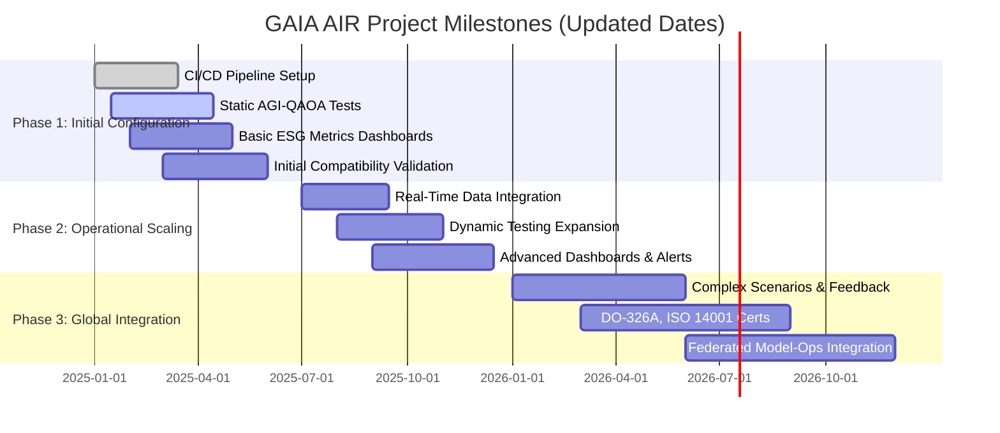
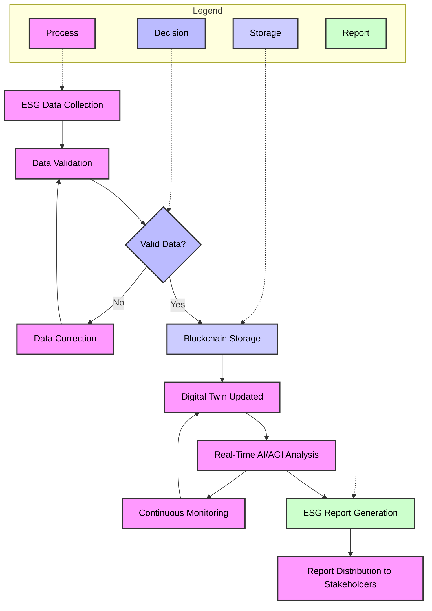

# **Plan Estratégico y Operativo para GAIA AIR A360XWLRGA (Versión Actualizada)**

## **Resumen Ejecutivo**

Este plan integral traza la hoja de ruta para la evolución y la adopción del **FTCode** en el ecosistema GAIA AIR A360XWLRGA. El FTCode, combinado con tecnologías emergentes como **IA/AGI**, **computación cuántica**, **blockchain** y **gemelos digitales**, junto con el cumplimiento de normativas internacionales (ISO, S1000D, ATA100, entre otras), permitirá una adopción ordenada, eficiente y sostenible. Además, fortalece procesos clave como **mantenimiento predictivo**, **integración con ERP/MES/SCADA** y **análisis de datos** para impulsar la eficiencia, reducir costos y consolidar el liderazgo de GAIA AIR A360XWLRGA en innovación aeronáutica.

**Beneficios a Largo Plazo:**
- **Eficiencia Operativa Continua:** Mejorar la productividad y reducir errores.
- **Reducción de Costos:** Mantenimiento predictivo y optimización de recursos.
- **Liderazgo en Innovación:** Adopción de IA/AGI, computación cuántica, gemelos digitales, blockchain.
- **Cumplimiento Normativo y Sostenibilidad:** Alineación con ISO14001, ESG y anulación completa de emisiones.

**Alineación Estratégica:**
Este plan se integra con la visión de GAIA AIR A360XWLRGA de ser pionera en sostenibilidad, tecnología avanzada y adopción ágil de normativas emergentes, garantizando así una ventaja competitiva sostenida.

---

## **Índice Evolutivo (Versión Final Integrada)**

1. [Fase Inicial (Fundamentos del FTCode)](#fase-inicial)  
2. [Fase de Integración Interna (Operaciones y Sistemas)](#fase-de-integracion-interna)  
3. [Fase de Ampliación Funcional (Generator y Mantenimiento Predictivo)](#fase-de-ampliacion-funcional)  
4. [Fase de Clasificación Avanzada (Data Organics)](#fase-de-clasificacion-avanzada)  
5. [Fase de Estandarización y Compliance (Plantillas, Flujos, I-CSDB)](#fase-de-estandarizacion-y-compliance)  
6. [Fase de Optimización Continua (Métricas y Mejora)](#fase-de-optimizacion-continua)  
7. [Fase de Escalamiento y Evolución Continua](#fase-de-escalamiento-y-evolucion-continua)  
8. [Índice Generativo (Versión Final Integrada)](#indice-generativo)  
9. [Integración DATADynamics/DocumentDynamics/AssemblyDynamics](#integracion-datadynamicsdocumentdynamicsassemblydynamics)  
10. [AI RATIO (System/Kluster Intelligence Ratio)](#ai-ratio)  
11. [¿Cómo Implementar los Cambios?](#como-implementar-los-cambios)  
12. [Próximos Pasos](#proximos-pasos)  
13. [Gestión de Riesgos](#gestion-de-riesgos)  
14. [Plan de Contingencia](#plan-de-contingencia)  
15. [Canales de Feedback y Adaptabilidad](#canales-de-feedback-y-adaptabilidad)  
16. [Plan de Comunicación Interna](#plan-de-comunicacion-interna)  
17. [Capacitación Continua](#capacitacion-continua)  
18. [Benchmarking y Mejores Prácticas](#benchmarking-y-mejores-practicas)  
19. [Evaluación de Impacto](#evaluacion-de-impacto)  
20. [Conclusión Final](#conclusion-final)  
21. [Glosario y Recursos Adicionales](#glosario-y-recursos-adicionales)

---

## **1. Fase Inicial (Fundamentos del FTCode)** <a name="fase-inicial"></a>

### Definición del Estándar FTCode

El **FTCode** es un estándar de codificación funcional diseñado para estandarizar y optimizar procesos internos en GAIA AIR A360XWLRGA. Abarca:

- **Alcance:** Todos los departamentos y procesos clave.
- **Contexto:** Adaptable a normativas internacionales y necesidades del sector aeroespacial.
- **Objetivos:** Mejora de trazabilidad, eficiencia y cumplimiento normativo.

### Objetivos Clave y Beneficios Esperados

- **Trazabilidad:** Facilitar el seguimiento y control de procesos y documentación.
- **Eficiencia:** Optimizar flujos de trabajo, reducir tiempos y errores.
- **Cumplimiento Normativo:** Asegurar alineación con ATA100, iSPEC2200, S1000D V6, ISO, DO.

### Tabla de Referencia de Campos

Incluye descripciones precisas de cada campo del FTCode, con ejemplos prácticos.

### Normativas y Estándares Básicos

- **ATA100, iSPEC2200, S1000D V6, ISO, DO:** Normativas internacionales clave.

### Roles y Responsabilidades

- **TEAMX (Integrador):** Coordina adopción del FTCode.  
- **TEAMSEC (Seguridad):** Cumplimiento normativo y seguridad.  
- **TEAMCOMM (Comunicaciones):** Integra FTCode con ERP/MES/SCADA.

### KPIs (Ejemplo SMART)

- 100% campos definidos/aprobados (Q2 2024).  
- Cumplimiento ISO27001 sin no conformidades (Q3 2024).

### Riesgos y Mitigaciones

- **Resistencia al Cambio:** Talleres introductorios.  
- **Falta de Claridad:** Actualizaciones periódicas de la tabla.

---

## **2. Fase de Integración Interna (Operaciones y Sistemas)** <a name="fase-de-integracion-interna"></a>

### Implementación del Modo Companion

- Integración fluida con FTCode, facilitando gestión y seguimiento.

### Distribución Interna y Capacitación

Plan de Capacitación:

- Mes 1: Taller FTCode/Modo Companion (TEAMX, TEAMY)  
- Mes 2: Taller MAINTAIN, HYBRID (Mantenimiento)  
- Mes 3: ISO14001, DIGITAL-TWIN-V02 (TEAMSEC)

Cobertura en Áreas Clave (Propulsión, Seguridad, Auxiliares):

- Evaluar adopción, detectar brechas.
- Integrar DATADynamics/DocumentDynamics/AssemblyDynamics.

### Roles Adicionales

- **TEAMY (I+D IA):** IA/AGI, cálculo AI RATIO.

### KPIs

- 90% usuarios capacitados (Q2 2024).  
- Reducir 20% el tiempo de búsqueda (Q3 2024).

### Riesgos

- Baja asistencia: Incentivos, horarios flexibles.  
- Dificultad adopción: FAQs, soporte continuo.

---

## **3. Fase de Ampliación Funcional (Generator y Mantenimiento Predictivo)** <a name="fase-de-ampliacion-funcional"></a>

### Modo Generator

- Validaciones, interfaces, APIs.

### Integración ERP/MES/SCADA

- Datos en tiempo real, mayor eficiencia y visibilidad.

### Tecnologías Emergentes

- IA/AGI: Reducir fallos 15% (Q4 2024).
- Computación Cuántica: Reducir tiempo vuelo 10% (Q1 2025).
- Gemelos Digitales, Blockchain: Trazabilidad y seguridad.

### Roles

- **TEAMAI (IA):** Modelos predictivos.  
- **TEAMINNO (Innovación):** Nuevas tecnologías.

### KPIs

- Reducir fallos no previstos 15% (Q4 2024).  
- Rutas -10% tiempo (Q1 2025).

### Riesgos

- Retrasos ERP/MES: Pilotos previos.  
- IA imprecisa: Ajustes iterativos.

---

## **4. Fase de Clasificación Avanzada (Data Organics)** <a name="fase-de-clasificacion-avanzada"></a>

### Data Organics

- Categorización (Sistémico, Procedimental, etc.).
- Dimensiones (Digital, Física, Híbrida).

### Trazabilidad y Decisiones

- Seguimiento y análisis IA.

### Roles

- **TEAMDATA (Datos):** Clasificación, dashboards.

### KPIs

- Reducir tiempo clasificación datos 15% (Q3 2024).  
- Aumentar precisión análisis 10% (Q3 2024).

### Riesgos

- Clasificación errónea: Revisión IA.  
- Etiquetas inadecuadas: Actualización semestral.

---

## **5. Fase de Estandarización y Compliance (Plantillas, Flujos, I-CSDB)** <a name="fase-de-estandarizacion-y-compliance"></a>

### Creación Automática del FTCode

- Plantillas JSON/XML.

### Flujos de Aprobación e I-CSDB

- Flujos claros, trazabilidad, seguridad.

### Aseguramiento Calidad (ISO14001, ESG)

- QA, mejora continua, visión cero emisiones.

### Roles

- **TEAMQA (Calidad y Compliance):** Validación, plantillas, normativas.

### KPIs

- Auditorías sin no conformidades (Q2 2025).  
- Reducir tiempo aprobación 20% (Q4 2024).

### Riesgos

- Normativas emergentes: Capacitación específica.  
- Plantillas desactualizadas: Revisiones semestrales.

---

## **6. Fase de Optimización Continua (Métricas y Mejora)** <a name="fase-de-optimizacion-continua"></a>

### Dashboards, Análisis Rendimiento

- Indicadores energéticos, fiabilidad.

### Mantenimiento Predictivo, Optimización Real Time

- Ajuste continuo con datos en tiempo real.

### Auditorías y Ajustes Iterativos

- Auditorías regulares, mejoras continuas.

### Roles

- **TEAMOPT (Optimización):** Monitoreo KPIs, auditorías.

### KPIs

- AI RATIO 75 a 80 (Q2 2025).  
- Reducir respuesta incidencias 15% (Q1 2025).

### Riesgos

- Falta seguimiento post-auditorías: Responsables y plazos definidos.

---

## **7. Fase de Escalamiento y Evolución Continua** <a name="fase-de-escalamiento-y-evolucion-continua"></a>

### Nuevos Materiales, Normativas, Cero Emisiones

- Energías renovables, anulación emisiones.

### Expansión a Nuevos Dominios

- Estrategias escalamiento, casos de uso.

### Mejora Constante Tecnológica

- IA, Gemelos Digitales, Modelos Predictivos.

### Roles

- **TEAMINNO (Innovación):** Roadmap tecnológico.

### KPIs

- 2 nuevas tecnologías/año.  
- Mejora indicadores ESG (Q4 2025).

### Riesgos

- Falta anticipación normativas: Vigilancia continua.  
- Dificultad técnica: Pilotos previos, equipo multidisciplinario.

---

## **Índice Generativo (Versión Final Integrada)** <a name="indice-generativo"></a>

1. Automatización FTCode (TEAMAUTO)  
2. Gestión Plantillas y Flujos (TEAMFLOW)  
3. Integración Sistemas Existentes (TEAMCOMM)  
4. Validación y Control Calidad (TEAMQA)  
5. Seguridad y Cumplimiento (TEAMSEC)  
6. Capacitación y Soporte (TEAMTRAIN)  
7. Dashboards y Modelos Predictivos (TEAMDATA)  
8. Actualización y Escalamiento FTCode (TEAMINNO)

---

## **Integración DATADynamics/DocumentDynamics/AssemblyDynamics** <a name="integracion-datadynamicsdocumentdynamicsassemblydynamics"></a>

Flujo Conceptual:

1. Necesidad/Curiosidad → Evento (Data Creation)  
2. Data Aggregation / Lakes (I-CSDB)  
3. Function Inference (IA/AGI, Ontologías, Cuántica)  
4. Klustering  
5. Etiquetado/Tags (Personal, Business, Público, Confidencial, Legal, Ético)  
6. Dimensión (Híbrido, Física, Digital)

Roles:

- **TEAMDATA:** Agregación, clasificación  
- **TEAMAI:** Inferencias, análisis predictivos  
- **TEAMSEC:** Control acceso, legalidad

---

## **AI RATIO (System/Kluster Intelligence Ratio)** <a name="ai-ratio"></a>

### Definición

Mide adopción y eficacia tecnológica.

### Componentes

- LAT, GPF, CCT, EF.

### Cálculo

\[AI\_RATIO = w_1 \times LAT + w_2 \times GPF + w_3 \times CCT + w_4 \times EF\]

Ejemplo: AI_Ratio=75 → Buena adopción, margen de mejora.

Roles:

- **TEAMDATA:** Calcula AI RATIO  
- **TEAMOPT:** Ajusta estrategias

---

## **¿Cómo Implementar los Cambios?** <a name="como-implementar-los-cambios"></a>

- **Integración Subsistemas (TEAMX):** KPI: % subsistemas integrados Q2 2024.  
- **Capacitación Específica (TEAMTRAIN):** KPI: 90% usuarios capacitados Q2 2024.  
- **Refinamiento Documentación (TEAMQA):** KPI: Actualizaciones Q3 2024.  
- **Ajustes Normativos (TEAMSEC):** KPI: Auditorías sin no conformidades Q2 2025.  
- **Monitoreo y Mejora (TEAMOPT):** KPI: AI RATIO 80 Q2 2025.

---

## **Próximos Pasos** <a name="proximos-pasos"></a>

1. Validación Piloto (TEAMX) en gemelos digitales.  
2. Ajustes Iterativos (TEAMOPT) según feedback.  
3. Integración Completa ERP/MES (TEAMCOMM).  
4. Refuerzo Mantenimiento Predictivo (TEAMAI).  
5. Expansión Nuevos Sistemas (TEAMINNO): Motores H2, energías renovables.  
6. Implementar AI RATIO (TEAMDATA).

---

## **Gestión de Riesgos** <a name="gestion-de-riesgos"></a>

| Riesgo                          | Prob. | Impacto | Mitigación                              |
|---------------------------------|-------|---------|------------------------------------------|
| Resistencia interna             | Alta  | Alta    | Talleres introductorios, soporte continuo|
| Retrasos integración ERP/MES    | Media | Alta    | Pilotos previos, entornos de prueba      |
| Incumplimiento normativo        | Media | Alta    | Capacitación específica, guías resumen   |
| Documentación desactualizada    | Baja  | Media   | Revisiones trimestrales                  |
| Baja asistencia capacitación    | Media | Media   | Incentivos, horarios flexibles           |

---

## **Plan de Contingencia** <a name="plan-de-contingencia"></a>

### Objetivo

Desarrollar estrategias para enfrentar eventos inesperados que puedan afectar la implementación del plan, asegurando la continuidad y minimizando el impacto negativo.

### Estrategias de Contingencia

1. **Fallas Tecnológicas:**
   - **Acción:** Implementar sistemas de respaldo y redundancia.
   - **Responsable:** TEAMCOMM y TEAMAI.
   - **Recursos Necesarios:** Infraestructura de servidores redundantes, software de recuperación.

2. **Interrupciones en la Cadena de Suministro:**
   - **Acción:** Diversificar proveedores y mantener inventarios críticos.
   - **Responsable:** TEAMINNO.
   - **Recursos Necesarios:** Contratos con múltiples proveedores, sistemas de gestión de inventarios.

3. **Ciberataques:**
   - **Acción:** Fortalecer las medidas de ciberseguridad y realizar auditorías periódicas.
   - **Responsable:** TEAMSEC.
   - **Recursos Necesarios:** Herramientas de seguridad, personal capacitado en ciberseguridad.

4. **Cambios Regulatorios Súbitos:**
   - **Acción:** Mantener un equipo de vigilancia normativa y adaptar rápidamente los procesos.
   - **Responsable:** TEAMSEC y TEAMQA.
   - **Recursos Necesarios:** Acceso a bases de datos regulatorias, formación continua.

5. **Resistencia Organizacional Elevada:**
   - **Acción:** Intensificar las campañas de comunicación y ofrecer incentivos adicionales.
   - **Responsable:** TEAMCOMM y TEAMTRAIN.
   - **Recursos Necesarios:** Presupuesto para incentivos, materiales de comunicación mejorados.

### Procedimiento de Activación

1. **Identificación del Evento:** Monitorización constante de indicadores clave y canales de feedback.
2. **Evaluación del Impacto:** Análisis rápido para determinar la gravedad y el alcance.
3. **Implementación de la Contingencia:** Activar las estrategias predefinidas según el tipo de evento.
4. **Comunicación Interna:** Informar a todos los niveles de la organización sobre las acciones tomadas.
5. **Revisión y Aprendizaje:** Analizar la respuesta al evento y ajustar el plan de contingencia si es necesario.

---

## **Canales de Feedback y Adaptabilidad** <a name="canales-de-feedback-y-adaptabilidad"></a>

- Formulario intranet, encuestas post-sesión, reuniones mensuales.
- **TEAMOPT:** Gestiona feedback y mejoras.
- **KPIs:** Cantidad feedback, tiempo respuesta, satisfacción usuarios.

---

## **Plan de Comunicación Interna** <a name="plan-de-comunicacion-interna"></a>

### Objetivo

Asegurar una comunicación efectiva del plan estratégico a todos los niveles de la organización, garantizando que todos los empleados comprendan su rol en la implementación y se sientan involucrados en el proceso.

### Estrategias de Comunicación

1. **Lanzamiento del Plan:**
   - **Acción:** Presentación oficial del plan en una reunión general.
   - **Responsable:** Alta dirección y TEAMCOMM.
   - **Recursos Necesarios:** Presentaciones, materiales audiovisuales.

2. **Boletines Informativos:**
   - **Acción:** Enviar boletines mensuales destacando avances, hitos y próximos pasos.
   - **Responsable:** TEAMCOMM.
   - **Recursos Necesarios:** Plataforma de email marketing, contenido redactado.

3. **Intranet Corporativa:**
   - **Acción:** Publicar el plan completo y actualizaciones periódicas en la intranet.
   - **Responsable:** TEAMCOMM.
   - **Recursos Necesarios:** Acceso a la intranet, contenido actualizado.

4. **Reuniones Departamentales:**
   - **Acción:** Organizar reuniones específicas por departamento para detallar cómo el plan afecta sus operaciones.
   - **Responsable:** Líderes de departamento y TEAMCOMM.
   - **Recursos Necesarios:** Salas de reunión, presentaciones personalizadas.

5. **Sesiones de Preguntas y Respuestas:**
   - **Acción:** Realizar sesiones periódicas donde los empleados puedan hacer preguntas y expresar inquietudes.
   - **Responsable:** TEAMCOMM y líderes de proyecto.
   - **Recursos Necesarios:** Moderadores, plataforma de videoconferencia.

6. **Materiales Educativos:**
   - **Acción:** Distribuir guías, FAQs y videos explicativos sobre el FTCode y otras iniciativas tecnológicas.
   - **Responsable:** TEAMTRAIN y TEAMCOMM.
   - **Recursos Necesarios:** Recursos de diseño gráfico, producción de videos.

### Medición de la Eficacia de la Comunicación

- **Encuestas de Satisfacción:** Evaluar la comprensión y satisfacción de los empleados con la comunicación recibida.
- **Tasa de Participación:** Medir la asistencia a reuniones y sesiones de Q&A.
- **Feedback Directo:** Recopilar comentarios a través de formularios y canales abiertos en la intranet.

---

## **Indicadores de Sostenibilidad** <a name="indicadores-de-sostenibilidad"></a>

### Objetivo

Complementar los KPIs operativos con indicadores específicos de sostenibilidad para monitorear y promover prácticas ecológicas dentro de GAIA AIR A360XWLRGA.

### Indicadores Clave

1. **Reducción de la Huella de Carbono:**
   - **KPI:** Disminución del 25% en emisiones de CO₂ para 2026.
   - **Medición:** Monitoreo de emisiones anuales comparado con líneas base establecidas.

2. **Uso de Energías Renovables:**
   - **KPI:** Incrementar el uso de energías renovables al 50% para 2025.
   - **Medición:** Porcentaje de energía consumida proveniente de fuentes renovables.

3. **Reciclaje de Materiales:**
   - **KPI:** Alcanzar una tasa de reciclaje del 75% en desechos operativos para 2025.
   - **Medición:** Cantidad de materiales reciclados versus total de desechos generados.

4. **Eficiencia Energética:**
   - **KPI:** Mejorar la eficiencia energética en un 20% para 2025.
   - **Medición:** Consumo energético por unidad de producción.

5. **Gestión de Residuos Peligrosos:**
   - **KPI:** Reducir en un 30% los residuos peligrosos generados para 2025.
   - **Medición:** Volumen de residuos peligrosos tratados y eliminados adecuadamente.

### Implementación de los Indicadores

- **Monitoreo Continuo:** Utilizar sistemas de gestión ambiental para recopilar y analizar datos en tiempo real.
- **Reportes Trimestrales:** Publicar informes de sostenibilidad trimestrales para evaluar el progreso.
- **Iniciativas de Mejora:** Implementar proyectos específicos para alcanzar los objetivos establecidos en cada indicador.

---

## **Capacitación Continua** <a name="capacitacion-continua"></a>

### Objetivo

Asegurar que los empleados de GAIA AIR A360XWLRGA se mantengan actualizados con las nuevas tecnologías y normativas a lo largo del tiempo, fomentando un entorno de aprendizaje continuo.

### Estrategias de Capacitación

1. **Programa de Formación Anual:**
   - **Acción:** Desarrollar un calendario anual de capacitaciones sobre nuevas tecnologías, normativas y mejores prácticas.
   - **Responsable:** TEAMTRAIN.
   - **Recursos Necesarios:** Instructores especializados, plataformas de e-learning.

2. **Cursos Online y Presenciales:**
   - **Acción:** Ofrecer una combinación de cursos online y talleres presenciales para adaptarse a diferentes estilos de aprendizaje.
   - **Responsable:** TEAMTRAIN.
   - **Recursos Necesarios:** Plataformas LMS, espacios físicos para talleres.

3. **Certificaciones Profesionales:**
   - **Acción:** Incentivar a los empleados a obtener certificaciones relevantes en tecnologías emergentes y sostenibilidad.
   - **Responsable:** Recursos Humanos y TEAMTRAIN.
   - **Recursos Necesarios:** Financiamiento para cursos, tiempo dedicado para el estudio.

4. **Sesiones de Actualización Semestrales:**
   - **Acción:** Realizar sesiones de actualización cada seis meses para informar sobre avances tecnológicos y cambios normativos.
   - **Responsable:** TEAMTRAIN.
   - **Recursos Necesarios:** Presentaciones, materiales informativos.

5. **Mentoría y Coaching:**
   - **Acción:** Implementar programas de mentoría donde empleados con experiencia guíen a nuevos integrantes en el uso de tecnologías y cumplimiento normativo.
   - **Responsable:** TEAMTRAIN y líderes de equipo.
   - **Recursos Necesarios:** Recursos humanos para actuar como mentores, estructura de programa.

6. **Evaluaciones de Competencias:**
   - **Acción:** Realizar evaluaciones periódicas para identificar áreas de mejora y necesidades de capacitación adicional.
   - **Responsable:** TEAMTRAIN y Recursos Humanos.
   - **Recursos Necesarios:** Herramientas de evaluación, feedback estructurado.

### Medición de la Eficacia de la Capacitación

- **Tasa de Finalización de Cursos:** Porcentaje de empleados que completan los programas de capacitación.
- **Evaluaciones de Conocimiento:** Resultados de pruebas antes y después de las capacitaciones.
- **Aplicación Práctica:** Medición del uso efectivo de conocimientos adquiridos en el entorno laboral.
- **Satisfacción de los Empleados:** Encuestas de satisfacción post-capacitación.

---

## **Benchmarking y Mejores Prácticas** <a name="benchmarking-y-mejores-practicas"></a>

### Objetivo

Comparar el desempeño de GAIA AIR A360XWLRGA con otras empresas líderes en la industria aeroespacial para identificar áreas de mejora y adoptar las mejores prácticas.

### Estrategias de Benchmarking

1. **Identificación de Competidores y Líderes del Sector:**
   - **Acción:** Seleccionar empresas reconocidas por su excelencia en sostenibilidad, tecnología y eficiencia operativa.
   - **Responsable:** TEAMINNO y TEAMOPT.
   - **Recursos Necesarios:** Investigación de mercado, bases de datos industriales.

2. **Selección de Indicadores Clave de Desempeño (KPIs) para Benchmarking:**
   - **Acción:** Definir KPIs relevantes para comparar aspectos operativos, tecnológicos y sostenibles.
   - **Responsable:** TEAMOPT.
   - **Recursos Necesarios:** Análisis de KPIs existentes y pertinentes.

3. **Recopilación y Análisis de Datos:**
   - **Acción:** Obtener datos de desempeño de las empresas seleccionadas a través de informes anuales, estudios de caso y colaboraciones.
   - **Responsable:** TEAMOPT y TEAMDATA.
   - **Recursos Necesarios:** Acceso a informes públicos, acuerdos de colaboración.

4. **Identificación de Mejores Prácticas:**
   - **Acción:** Analizar las estrategias exitosas de las empresas líderes y evaluar su aplicabilidad en GAIA AIR A360XWLRGA.
   - **Responsable:** TEAMINNO.
   - **Recursos Necesarios:** Talleres de análisis, sesiones de brainstorming.

5. **Implementación de Mejores Prácticas:**
   - **Acción:** Adaptar e integrar las mejores prácticas identificadas en los procesos internos.
   - **Responsable:** Líderes de equipo y TEAMINNO.
   - **Recursos Necesarios:** Recursos humanos y financieros, ajustes en procesos operativos.

6. **Monitoreo y Revisión Continua:**
   - **Acción:** Establecer un proceso continuo de benchmarking para asegurar la mejora constante.
   - **Responsable:** TEAMOPT.
   - **Recursos Necesarios:** Herramientas de monitoreo, reuniones periódicas de revisión.

### Beneficios del Benchmarking

- **Identificación de Oportunidades de Mejora:** Descubrir áreas donde GAIA AIR A360XWLRGA puede optimizarse.
- **Adopción de Innovaciones:** Incorporar tecnologías y procesos que han demostrado ser efectivos en otras empresas.
- **Aumento de la Competitividad:** Mejorar el posicionamiento en el mercado al alinearse con estándares de excelencia reconocidos.

---

## **Evaluación de Impacto** <a name="evaluacion-de-impacto"></a>

### Objetivo

Medir el impacto del plan estratégico en términos de sostenibilidad, eficiencia operativa y cumplimiento normativo, asegurando que los objetivos se estén cumpliendo y ajustando las estrategias según sea necesario.

### Mecanismos de Evaluación

1. **Evaluaciones Trimestrales:**
   - **Acción:** Realizar evaluaciones trimestrales para revisar el progreso hacia los KPIs establecidos.
   - **Responsable:** TEAMOPT y TEAMDATA.
   - **Recursos Necesarios:** Herramientas de análisis de datos, informes de progreso.

2. **Análisis de Sostenibilidad:**
   - **Acción:** Evaluar los indicadores de sostenibilidad y su evolución a lo largo del tiempo.
   - **Responsable:** TEAMQA y TEAMOPT.
   - **Recursos Necesarios:** Datos ambientales, informes de sostenibilidad.

3. **Revisiones de Eficiencia Operativa:**
   - **Acción:** Analizar la eficiencia operativa mediante el seguimiento de KPIs específicos y comparar con benchmarks internos y externos.
   - **Responsable:** TEAMOPT.
   - **Recursos Necesarios:** Informes operativos, análisis comparativos.

4. **Auditorías de Cumplimiento Normativo:**
   - **Acción:** Realizar auditorías periódicas para asegurar el cumplimiento continuo con las normativas internacionales y estándares internos.
   - **Responsable:** TEAMQA.
   - **Recursos Necesarios:** Checklists de auditoría, personal auditor.

5. **Encuestas de Satisfacción y Feedback:**
   - **Acción:** Recopilar feedback de los empleados y partes interesadas sobre la implementación del plan y su percepción del impacto.
   - **Responsable:** TEAMOPT y TEAMCOMM.
   - **Recursos Necesarios:** Herramientas de encuestas, análisis de resultados.

6. **Informe Anual de Impacto:**
   - **Acción:** Publicar un informe anual que resuma los logros, desafíos y lecciones aprendidas.
   - **Responsable:** Alta dirección y TEAMOPT.
   - **Recursos Necesarios:** Datos recopilados, redacción de informes.

### Ajustes Basados en la Evaluación

- **Identificación de Desviaciones:** Detectar áreas donde el desempeño no está alineado con los objetivos.
- **Revisión de Estrategias:** Ajustar las estrategias y tácticas para abordar las desviaciones identificadas.
- **Implementación de Mejoras:** Aplicar cambios necesarios para optimizar el desempeño y alcanzar los objetivos establecidos.

---

## **Conclusión Final** <a name="conclusion-final"></a>

Esta versión actualizada del plan estratégico y operativo para GAIA AIR A360XWLRGA es aún más robusta y completa, integrando aspectos cruciales para la implementación exitosa del FTCode y el logro de los objetivos de sostenibilidad y eficiencia. La incorporación de un cronograma detallado de implementación tecnológica, un plan de comunicación interna efectivo, indicadores específicos de sostenibilidad, un programa de capacitación continua, procesos de benchmarking, mecanismos de evaluación de impacto y un plan de contingencia robusto, asegura que GAIA AIR A360XWLRGA esté bien posicionada para enfrentar desafíos y aprovechar oportunidades en el sector aeroespacial.

**Llamado a la Acción:**  
Comprométanse con el plan, participen en capacitaciones, mantengan una comunicación abierta y aporten feedback constante. Juntos, fortaleceremos el liderazgo de GAIA AIR A360XWLRGA hacia un futuro sostenible y tecnológicamente avanzado.

---

## **Glosario y Recursos Adicionales** <a name="glosario-y-recursos-adicionales"></a>

- **FTCode:** Estándar codificación funcional.  
- **ERP/MES/SCADA:** Sistemas empresariales y manufactura.  
- **AI/AGI:** Inteligencia Artificial / Inteligencia Artificial General.  
- **ISO14001, ESG:** Normas ambientales y sociales.  
- **Gemelo Digital:** Réplica digital de procesos físicos.  
- **I-CSDB:** Integrated Computer Software Data Base.  
- **AI RATIO:** Métrica adopción tecnológica.  
- **MAINTAIN, HYBRID:** Mantenimiento predictivo, optimización híbrida.

**Anexos:**  
- Plantillas JSON/XML FTCode.  
- Guías ISO14001 resumidas.  
- Plantillas KPI y Matriz Riesgos.

---

**From these Freudian depths, GAIA DS emerges.**

This poetic expression suggests that GAIA DS, as a comprehensive and multifaceted framework, arises from profound conceptual foundations—akin to deep psychological layers or underlying motivators. Its origins and principles may be rooted in complex, introspective, and deeply analyzed considerations.

**Context for Sustainable Development:**

The need to develop a system determines its functional requirements and the necessary functionality. In industrial, distributed landscapes, it is urgent to prioritize development that is sustainable, fair, and auditable. This ensures that innovation and growth do not come at the expense of environmental health, ethical standards, or transparency.

---

**Requirement ID:** GAIA-DS-FR-01

**Requirement Class Card:**
This identifier (class card) can serve as a reference at various organizational levels:

- **Document ID:** Linking the requirement to a specific reference or specification document.
- **Project ID:** Associating the requirement with a particular GAIA DS project or initiative.
- **System ID:** Mapping the requirement to a system, subsystem, or portfolio within GAIA DS.
- **Org ID:** Connecting the requirement to an organizational or departmental unit accountable for its implementation.

**Top-Level Class Card (Portfolio):** Sustainable Development

**Functional Requirement (FR) 01:** Principal Framework (01)

---

**Description:**
The GAIA-DS-FR-01 requirement establishes the primary sustainable development framework at the portfolio level of the GAIA DS ecosystem. It defines the overarching principles, directives, and strategic objectives guiding all underlying projects and systems within the GAIA DS portfolio. Through this top-level requirement, GAIA DS ensures a unified approach to sustainability, encompassing environmental, social, economic, and technological dimensions.

---

**Key Objectives:**
1. **Alignment with Sustainability Targets:**  
   Align all GAIA DS initiatives with sustainability objectives (e.g., significant emission reductions, circular economy goals).

2. **Regulatory Compliance:**  
   Ensure adherence to global regulatory standards (EASA, FAA, ISO 14040, DO-326A) and industry best practices.

3. **Technological Integration:**  
   Incorporate advanced technologies (AI/AGI, QAOA, digital twins, blockchain) into sustainable, responsible operational models.

4. **Governance and Continuous Improvement:**  
   Maintain coherent governance structures (PROS, PRBS, SPLR-GAIA Quantum Portal, DOS, ReFrame) to support continuous improvement, innovation, and stakeholder engagement.

---

**Scope and Applicability:**
This requirement applies to the entire GAIA DS portfolio, including all subprograms (Aerospace, Computing & IT, Defense & Security, Space, Cross-Agency Sustainability) and their associated projects, systems, and organizational units. By encompassing the full range of GAIA DS activities, GAIA-DS-FR-01 ensures a consistently sustainable approach across diverse fields.

---

**Rationale:**
By defining a principal sustainable development framework as a functional requirement at the top-level portfolio stage, GAIA DS ensures consistent decision-making grounded in environmental and social responsibility. This approach fosters long-term resilience, competitiveness, and ethical innovation, aligning GAIA DS operations with global sustainability imperatives.

---

**Conclusion:**
GAIA-DS-FR-01 serves as the foundational functional requirement anchoring the GAIA DS portfolio’s commitment to sustainable development. It harmonizes various organizational, project, and system-level actions under a unified, sustainability-driven framework. In doing so, it guides the GAIA DS ecosystem to thrive responsibly, ethically, and transparently, meeting the urgent demands of industrial distributed landscapes and contributing to a cleaner, more efficient, and equitable future.

---

# GAIA DS: A Holistic and Sustainable Framework

**Definition:**  
GAIA DS (GAIA Sustainable Development) is a pioneering framework designed to address complex and interconnected challenges in sectors such as aerospace, sustainability, energy, defense, computing, and inter-agency collaboration. Envisioned by Amedeo Pelliccia, GAIA DS transcends traditional project boundaries, adopting a systems-of-systems approach that merges technological innovation, environmental stewardship, and social responsibility.

---

### Key Attributes of GAIA DS

**Multiscale:**  
GAIA DS operates across multiple scales—from nano-structured materials and advanced composites at the microscopic level to alignment with global regulatory and sustainability targets. It addresses community-level impacts, regional supply chain considerations, national regulatory standards, and international climate objectives simultaneously.

**Multidimensional:**  
GAIA DS spans various dimensions:
- **Technical:** Hybrid propulsion, DIFFUSP MHD engines, AI/AGI, QAOA, digital twins, IoT.
- **Environmental:** Circular economy, carbon reduction, waste minimization, high recyclability.
- **Economic:** Cost-effectiveness, long-term operational savings, stable supply chains, market competitiveness.
- **Social:** Ethical practices, community engagement, workforce development, transparency, academic and NGO collaboration.

**Multi-Objective:**  
GAIA DS targets multiple, often competing objectives:
- Carbon emission reductions (≥80% by 2050)
- Energy efficiency & reliability (improved MTBF)
- Circular economy (≥90% recyclability of critical materials)
- Regulatory compliance (EASA, FAA, ISO 14040, DO-326A)
- Innovation and social responsibility

**Multidomain:**  
GAIA DS extends across multiple domains and subprograms:
- **Aerospace (GAIA-AIR):** Hybrid propulsion, DIFFUSP MHD engines, advanced materials, sustainable aviation, ESG management.
- **Computing & IT (GAIA-COMPUTING-IT_PMOs):** HPC, cybersecurity, blockchain, CI/CD.
- **Defense & Security (GAIA-DEFENCE):** Secure communications, quantum-safe cryptography, resilient systems.
- **Space (GAIA-SPACE):** Methodologies extended to orbital platforms, satellites, interplanetary logistics.
- **Cross-Agency Sustainability (GAIA-SUSTAINABILITY-CROSS-AGENCY):** Harmonization of environmental policies and standards.

**Multi-Component & Multi-Stakeholder:**  
GAIA DS coordinates initiatives in propulsion (electric, hydrogen, solid-state batteries, DIFFUSP MHD), energy management (AI/AGI, QAOA, IoT sensors, digital twins), predictive maintenance, circular economy (DfD, blockchain), and security (AES-256, MFA, DO-326A).

**Multi-Program & Multi-Project:**  
GAIA DS integrates projects (GAIA AIR, GAIA SPACE, GAIA DEFENCE), R&D with universities, and IT/PMO functions to align with sustainable innovation goals.

**Master Triggers:** Regulatory shifts, technological breakthroughs (hydrogen, QAOA, composites), market & stakeholder feedback, environmental indicators, agile innovation cycles (CI/CD).

**Governance & Integration:**  
- PROS (Project Structure)
- PRBS (Product Breakdown Structure)
- SPLR-GAIA Quantum Portal (AI/AGI, QAOA, real-time monitoring, cybersecurity, quantum computing)
- DOS (Design Office Structure)
- ReFrame (Research Framework)

**Validation, Verification & Continuous Improvement:**  
Rigorous testing (bench, CFD/EM), external audits (EASA, FAA, ISO), continuous improvement loops, transparent documentation (S1000D), and robust training.

**Conclusion GAIA DS:**  
GAIA DS, as envisioned by Amedeo Pelliccia, sets the stage for a cleaner, more efficient, resilient, and globally connected aerospace industry by aligning environmental goals, technological advancement, circular economy principles, and regulatory compliance.

---

# POST

## GAIA AIR - Mermaid Diagrams

**Description:**  
This section includes Mermaid diagrams for GAIA AIR, supporting decision-making, ESG data management, and operational transparency.

### Gantt Diagram - GAIA AIR Project Milestones (Updated Dates)

**Description:**  
Shows project phases, milestones, progress, and dependencies.



### ESG Traceability Flowchart

**Description:**  
Illustrates ESG data handling in GAIA AIR: collection, validation, blockchain storage, digital twins, AI/AGI analysis, and ESG reporting.



**Notes:**
- Code block closure: triple backticks.
- Aspect ratio adjustable in the rendering platform.
- Font size increased to 16px for readability.
- Ensure Mermaid compatibility (Docsify, Asciidoctor, etc.).

---

## Expanding GAIA DS

- **Computing & IT (GAIA-COMPUTING-IT_PMOs):** HPC, cybersecurity, blockchain, CI/CD.
- **Defense & Security (GAIA-DEFENCE):** Secure communications, quantum-safe cryptography, resilient systems.
- **Space (GAIA-SPACE):** Orbital platforms, satellites, interplanetary logistics.
- **Cross-Agency Sustainability (GAIA-SUSTAINABILITY-CROSS-AGENCY):** Harmonizing environmental policies and standards.

Multi-Program & Multi-Project Integration: R&D with universities, market strategies (GAIA-INTERCONNECTED-PROGRAMS), and IT/PMO functions ensure alignment with sustainable and innovative objectives.

**Master Triggers & Governance:** Regulatory changes, tech advances, market feedback, environmental indicators, and agile innovation cycles guide actions. PROS, PRBS, SPLR-GAIA Quantum Portal, DOS, ReFrame ensure clarity, methodology, and adaptability.

---

## System Requirements Specification (SRS) - GAIA DS

**Context SRS:**  
A long-range, high-capacity hybrid aircraft with DIFFUSP MHD engines aligned with GAIA DS principles. The SRS includes objectives, scope, functional/non-functional requirements, regulatory compliance, circular economy, security, AI/AGI, QAOA, digital twins, blockchain, and cybersecurity.

**ATA JASC Index:**  
An adapted 8-digit ATA JASC index for GAIA AIR systems, subsystems, and components for efficient identification and management.

**Field Descriptions (ATA JASC):**  
System_Code, JASC_Code, Title, Description, Page_Number, CLASS_CATEGORY, DEEPLEVEL, DMC_DOMAIN_DESC, ASSIGNABLE_ATAXX_XX_XX_DESC, VERSION_MODEL, TYPE.

This SRS provides a foundation for validation, verification, risk management, updates, external audits (EASA, FAA, ISO), continuous improvement, and future scalability.

---

## Final Conclusion

GAIA DS, aligned with Amedeo Pelliccia’s vision, represents a complex, interconnected, and evolving ecosystem. Integrating sustainability, innovation, circular economy principles, AI/AGI, QAOA, cybersecurity, and international standards, GAIA DS redefines the aerospace industry toward a cleaner, more efficient, and resilient future.

This note sets a coherent foundation for ongoing expansions, validations, stakeholder engagement, and continuous technological evolution within the GAIA DS framework.

---

# Methods Token Library (MTL)

**A Unified Standard for Referencing and Managing Aerospace & Defense Methods**  
**A Transformative Framework for Automating Workflows and Standardizing Aerospace & Defense Methods**

Welcome to the Methods Token Library (MTL) repository. This project provides a scalable, standardized framework for referencing common procedures, tasks, and methods used throughout the aerospace and defense industries. By encapsulating methods—such as maintenance steps, inspection techniques, or calibration instructions—into discrete, version-controlled “tokens,” MTL establishes a single source of truth that streamlines technical documentation, operational workflows, and work order deliveries.

The result: **reduced redundancy, faster updates, improved efficiency, safety, cost-effectiveness, and a future-proof approach** to integrating emerging technologies and industry standards.

---

## What is MTL?

The MTL is a global reference system where industry-standard methods are stored as reusable tokens. Instead of rewriting identical instructions across multiple manuals or data modules, you reference an MTL token. Any updates to a token automatically reflect in all associated documents, ensuring continuous alignment with best practices, regulatory changes, and new technologies.

### Key Features

- **Standardized Methods:** Each method token follows a controlled naming and versioning scheme, reducing ambiguity and ensuring uniformity.
- **Single-Source Updates:** Revise a method once in the MTL, and all referencing documents and workflows update automatically—no manual intervention needed.
- **Interoperability:** The MTL integrates seamlessly with S1000D data modules, ATA chapters, and other aerospace standards.
- **Support for Advanced Technologies:** Integrate Additive Layer Manufacturing (ALM), Quantum Computing Modules (QCM), Blockchain-based security (BIT), and IoT-driven insights without overhauling documentation strategies.

---

## Repository Structure

- **`/docs`**:  
  - `MTL_Standard.md`: MTL format specification, code structures, lifecycle governance.  
  - `Methods_Glossary.md`: Controlled vocabulary and acronyms, following Simplified Technical English (STE).  
  - `Examples/`: Sample tokens, reference data modules, integration scenarios.

- **`/schema`**: Proposed XML/JSON schemas and APIs for integrating MTL tokens with authoring tools, CMS, or IoT platforms.

- **`/tools`**: Scripts, validators, utilities for token searching, version comparisons, and documentation stub generation.

---

## Naming Convention

Each token follows:
```
MT-<DOMAIN>-<METHODID>-<VERSION>
```
- `MT`: Methods Token prefix.
- `<DOMAIN>`: Domain code (e.g., NDT for Non-Destructive Testing).
- `<METHODID>`: Unique method ID (e.g., CLEAN001, ULTRAS-INS).
- `<VERSION>`: Version control (e.g., V01, V02).

**Example:** `MT-NDT-ULTRAS-INS-V01` for a standard ultrasonic inspection method (NDT domain), version 1.

---

## Integration with S1000D and ATA

- **S1000D:** In Maintenance Procedures (MP), Operation Procedures (OP), or System Descriptions (SD), reference tokens directly. For example:
  *“Perform ultrasonic inspection as per `MT-NDT-ULTRAS-INS-V01`.”*

- **ATA Chapters:** Align tokens with ATA chapters (e.g., ATA24 for electrical) to maintain familiarity and bridge traditional and modern frameworks.

---

## Dictionary and Simplified Technical English (STE)

The MTL dictionary ensures consistent terminology and adherence to STE, enabling global teams—human or AI-driven—to interpret instructions without ambiguity.

**See:** [`docs/Methods_Glossary.md`](./docs/Methods_Glossary.md)

---

## Contributing

We invite participation from aerospace OEMs, airlines, MROs, regulators, and experts:

- **Propose New Methods:** Submit new tokens with rationale, domain, usage context.
- **Improve Existing Methods:** Increment versions when standards evolve.
- **Expand the Dictionary:** Add STE-compliant terms to unify language across the industry.

Before contributing, review [`MTL_Standard.md`](./docs/MTL_Standard.md) and follow coding conventions and approval processes.

---

## License

This project is licensed under the [Creative Commons Attribution-ShareAlike 4.0 International (CC BY-SA 4.0)](https://creativecommons.org/licenses/by-sa/4.0/).

By using or contributing, you agree to:

- **Attribution:** Credit the MTL project and contributors.
- **ShareAlike:** Any derivatives must remain under CC BY-SA 4.0.

See [LICENSE](./LICENSE) for full details.

---

## Contact & Community

- **Issues & Requests:** Use GitHub Issues for bugs, feature requests, and improvements.  
- **Mailing List/Forum (Planned):** For in-depth governance and best practice discussions.  
- **Workshops & Working Groups:** For consortiums, regulatory bodies, or industry groups interested in adopting MTL, open an issue or contact maintainers.

---

## Future Roadmap

- **API Integration:** REST/GraphQL for real-time token retrieval.
- **Blockchain-Verified Updates (BIT):** Ensure tamper-proof versioning and compliance auditing.
- **IoT & AR/VR Tools:** Serve instructions directly to AR headsets or IoT-connected tools for real-time, on-site guidance.

---

## MTL’s Role in Automating Workflows and Work Order Deliveries

### 1. Automating Workflows

- **Standardized Referencing:** A single source of truth eliminates duplicated instructions.  
- **CMS & IoT Integration:** Authors embed token references once; IoT sensors trigger auto-generated work orders referencing the correct token.
- **Dynamic Maintenance & Repair:** Sensor-detected faults issue task orders aligned with the latest methods, ensuring technicians follow current best practices.

### 2. Automating Work Order Deliveries

- **Direct Token Integration:** Work orders cite tokens like `MT-NDT-ULTRAS-INS-V01`, guaranteeing accuracy and up-to-date instructions.
- **Blockchain Verification:** GAA-BIT integration provides tamper-proof records, ensuring compliance and verifiable audit trails.

### 3. Standardizing Design Processes

- **Consistent Documentation:** Aligning tokens with S1000D/ATA ensures a shared language across organizations.
- **Modular & Iterative Updates:** A token update cascades through all documentation and design references, simplifying compliance and adaptability.
- **Enhanced Collaboration:** OEMs, MROs, and regulators streamline communication and focus on innovation rather than resolving documentation conflicts.

### 4. Roadmap for Implementation

- **Phase 1:** Core MTL framework, naming conventions, S1000D/ATA integration.
- **Phase 2:** Develop APIs, automate workflow tasks, link IoT signals.
- **Phase 3:** Add blockchain-based version control and compliance checks.
- **Phase 4:** AR/VR interfaces, AI-driven predictive maintenance integration.
- **Phase 5:** Ongoing feedback loops and scalability to new methods/technologies.

### Economic Impact

- **Efficiency Gains:** Reduced redundancy and streamlined documentation lower administrative burdens and operational costs.
- **Safety & Compliance:** Uniform instructions and real-time updates improve adherence to regulations and reduce error risk.
- **Cost Savings & Innovation:** Freed from reconciling inconsistent documentation, teams can invest time in new tech development and performance optimization.

---

**In essence, MTL is not just a documentation tool—it’s a strategic enabler. By providing a unified, future-proof standard for referencing and maintaining aerospace and defense methods, MTL sets the stage for automated workflows, seamless work order deliveries, standardized design, and robust economic benefits.**
```
